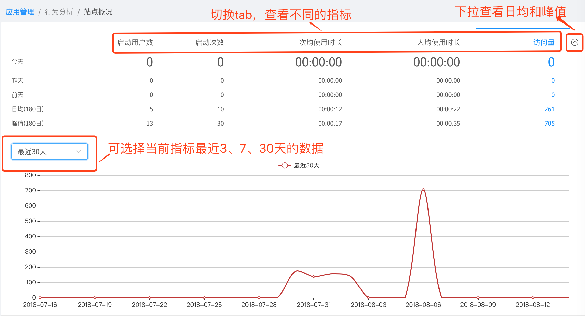
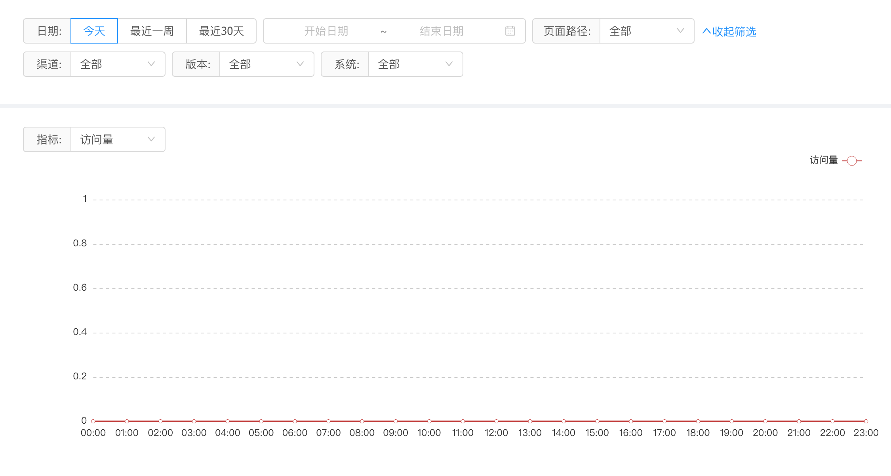
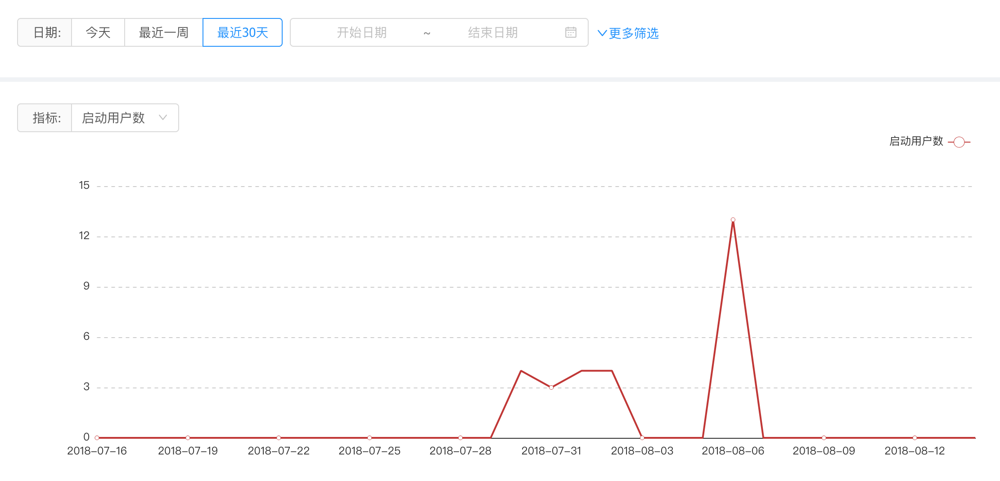
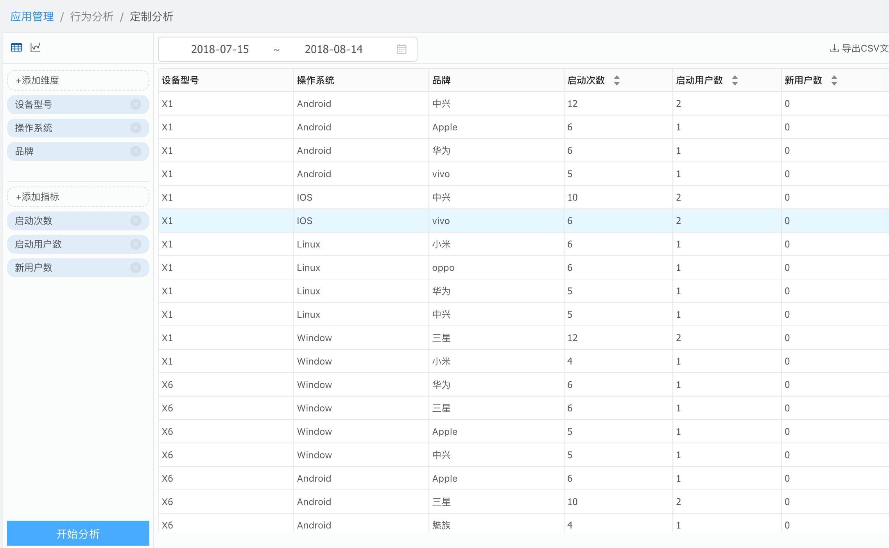
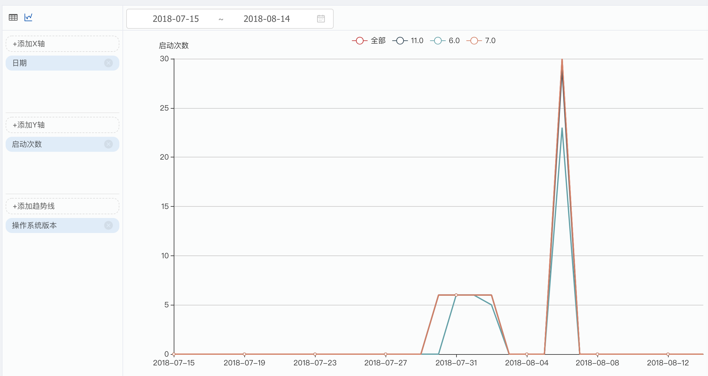
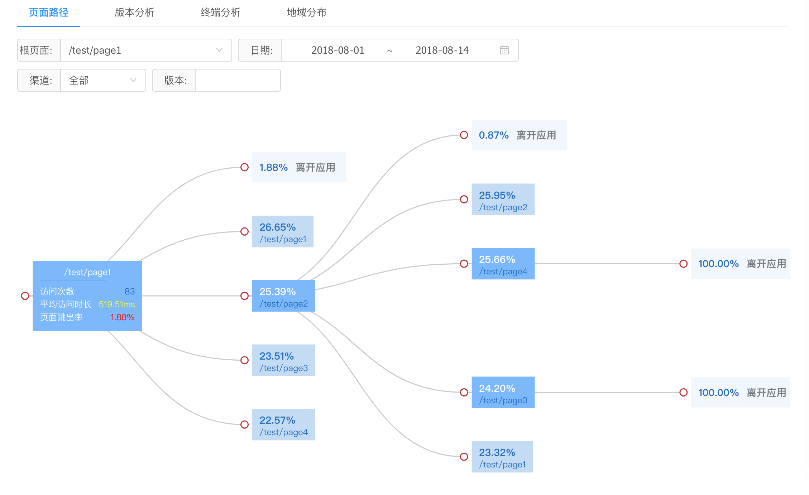
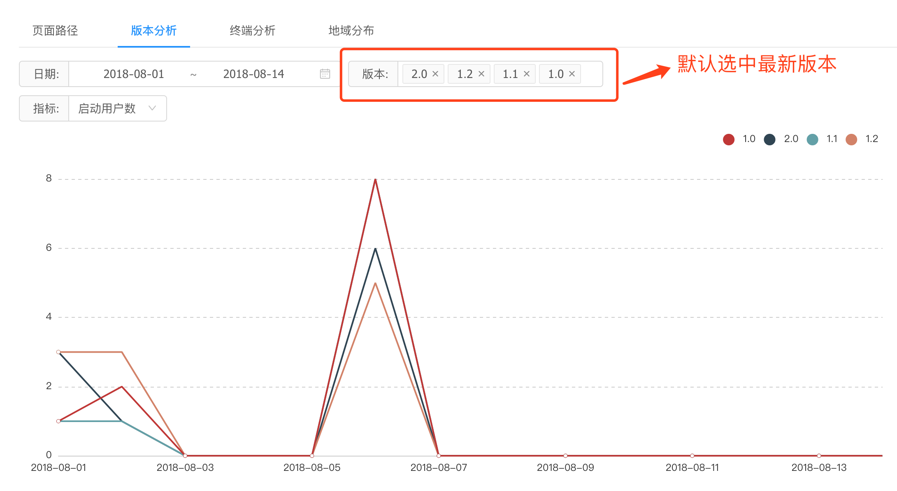
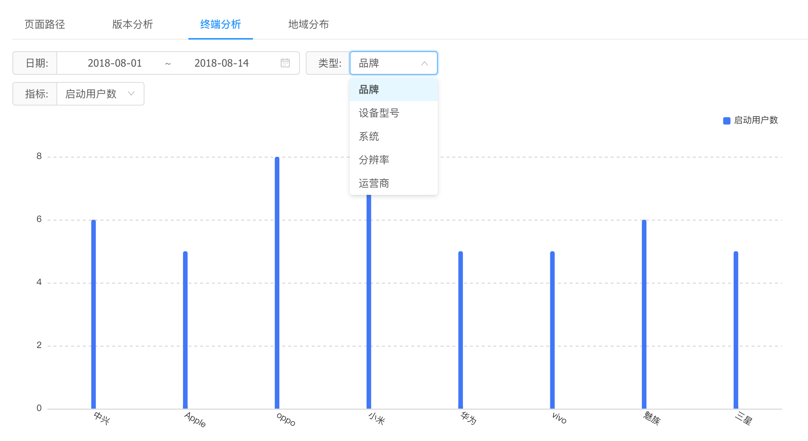
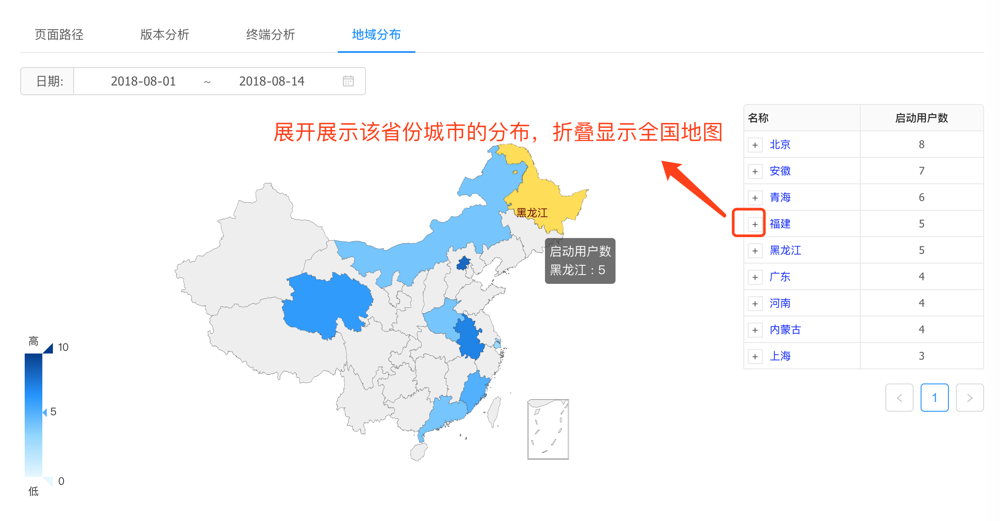

# 埋点操作手册
* 站点概况

* 页面分析 （按时间跨度分析页面的访问量、访客量、人均访问时长、次访问时长）
    - 访问量 : 用户每打开一个网站页面就被记录1次。用户多次打开同一页面，访问量值累计。
    - 访客量 : 时间跨度内页面的独立访客数(以设备ID去重)，同一设备ID访问只计算1个访客。
    - 人均访问时长 : 访客访问页面时所花费的平均时长，页面的访问时长=进入下一个页面的时间-进入本页面的时间。(以设备ID去重)
    - 次均访问时长 : 每次访问页面时所花费的平均时长，页面的访问时长=进入下一个页面的时间-进入本页面的时间。(以UID去重)

  
* 用户分析
    - 启动用户数：启动过该应用的用户（以独立设备为判断标准），通常也叫活跃用户
    - 新用户数：首次下载安装并激活该应用的用户。（以独立设备为判断标准）
    - 旧用户数：当日启动用户中，以前也启动过应用程序的用户
    - 日活/月活：日活跃用户数/月活跃用户数*100%
    - 累计用户数：总的用户数（以独立设备为判断标准）

* 事件分析(开发中。。。。)
* 定制分析 自由组合你需要的纬度和指标数据，有表格和图形两种展示方式

* 辅助指标
    - 页面路径 
        * 页面路径以“分叉图”的可视化界面展示了从某个页面出发的流量后续的流转情况。该报告可以帮助您对关于用户浏览行为的诸多典型业务问题分析
    
    - 版本分析(需要了解每个版本目前的用户体量，已确认在运营投入，研发维护等方面需要侧重于某些版本)
    
    - 终端分析(终端作为用户运行APP的载体，背后蕴藏这丰富的用户信息。分析用户终端，对于运营、产品和研发工作都十分必要)
    
    - 地域分布
        - 可视化地图，直观展示用户在全国范围内分布 
        - hover左侧地图，显示北京地区启动次数及在全国范围占比；右侧按启动次数从高到低展示当前省份排序
    