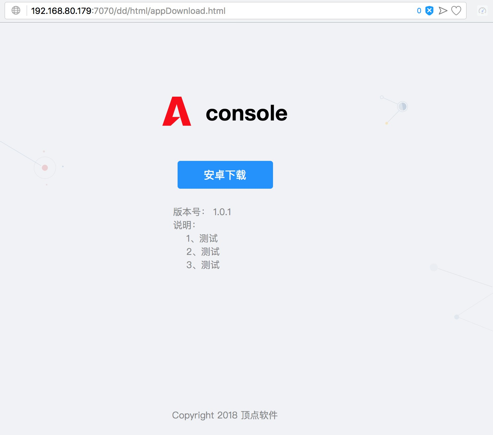

[【返回目录】](../README.md)
# 咚咚服务插件 AAS-Mobile
## 简介
咚咚服务插件aas-mobile，是用于开发手机App的基础插件，本插件集成了App发布，热更新，及异常追踪等功能。
1. 发布App: 原生的App版本发布。
2. 热更新：  RN的热更新版本发布。
3. 异常追踪：手机应用崩溃后的日志收集。

请参考控制台中的App菜单功能。

## 配置参数
在开发的项目中使用咚咚服务插件，只需要在application.yml中打开配置，如下所示。
```
aas:
  mobile:
    enabled: true  #true开启，false关闭
    app-file-path: /opt/assDownloads/version  #版本上传下载的目录
```
## 表结构
请参照 [aas-mobile.sql](scripts/aas-mobile.sql)
## App控制台
使用咚咚服务插件后，可使用App发布，热更新，异常追踪等功能的Api进行开发，并可在AMC-Server控制台中管理这些功能。

## App二维码和App下载
咚咚服务插件内置了App二维码扫码和下载的功能。在控制台中维护了App发布版本，并通过浏览器访问`http://127.0.0.1:7070/dd/html/appHome.html`页面。如下图所示：

>这里的请求地址为示例地址，具体需根据实际项目做相应的改变`x.x.x.x/xx/html/appHome.html`

二维码会判断请求的扫码设备，并跳转至不同的下载页面。（IOS设备或安卓设备）

通过扫码后页面会跳转至相应的下载页面。如下图所示：


## 自定义下载页面
如果项目不使用自带的二维码和下载页面，可以自定义实现这两个功能。咚咚服务插件提供相应的接口
```
二维码图片接: /aas/mobile/app/download2DImage
下载内容获取接口: /aas/mobile/app/downloadUrl
```
[【返回目录】](../README.md)
