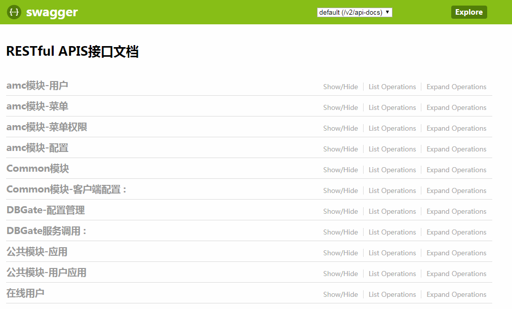
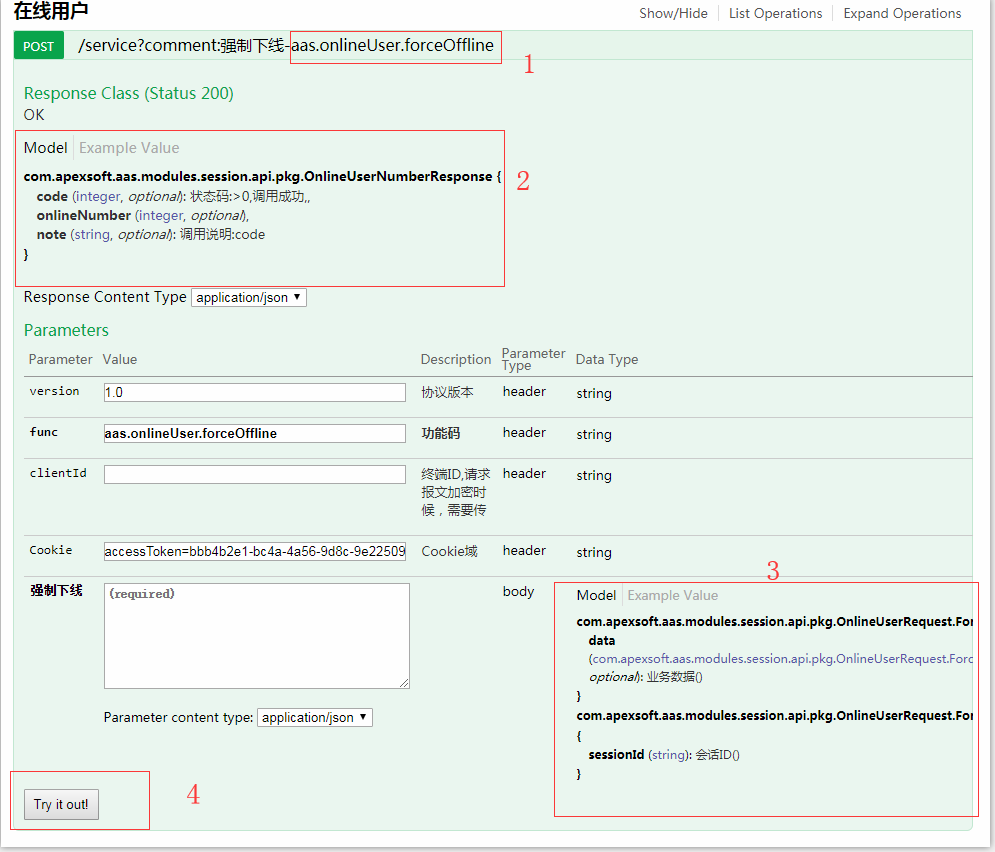
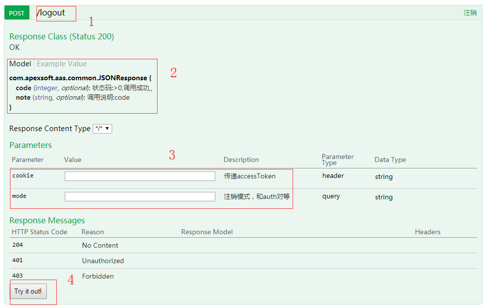

[【返回目录】](../README.md)
# Swagger插件

1. 开启Swagger插件,重启服务

    ```yaml

    aas:
      swagger:
        enabled: true  #是否启用swagger
    ```

2. 访问SwaggerAPI

    > http://localhost:8080/swagger-ui.html

    

3. SwaggerAPI功能说明

    ## 功能码型接口
    

    > 位置1：功能码
    >
    > 位置2： 输出参数
    >
    > 位置3: 输入参数
    >
    > 位置4: 在线测试按钮

    ## PATH接口

    

    > 位置1：访问PATH
    >
    > 位置2： 输出参数
    >
    > 位置3: 输入参数
    >
    > 位置4: 在线测试按钮

[【返回目录】](../README.md)
