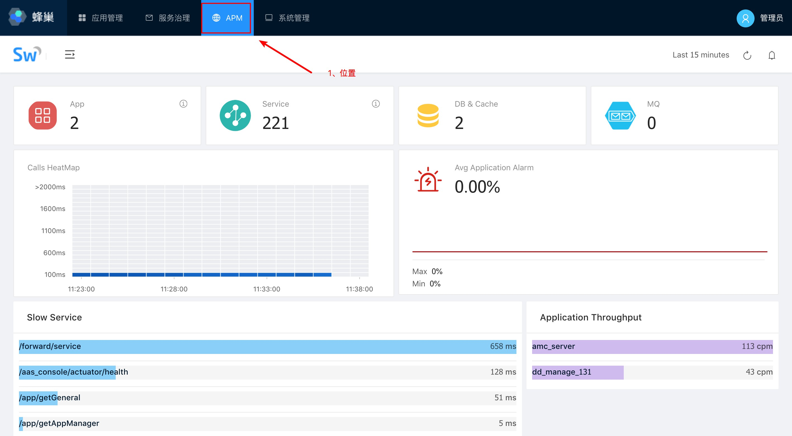

[【返回目录】](../README.md)

# APM

&nbsp;&nbsp;&nbsp;&nbsp;本平台中使用的APM系统，采用Apache SkyWalking的开源项目。SkyWalking: 针对分布式系统的APM（应用性能监控）系统，特别针对微服务、cloud native和容器化(Docker, Kubernetes, Mesos)架构。
&nbsp;&nbsp;&nbsp;&nbsp;**本平台使用的是Skywalking Beta 5.0版本**

### 参考资料
[全文搜索引擎 Elasticsearch 入门教程](http://www.ruanyifeng.com/blog/2017/08/elasticsearch.html)
[Skywalking官方文档说明](https://gitee.com/OpenSkywalking/sky-walking)
[skywalking源码下载](http://www.apache.org/dyn/closer.cgi/incubator/skywalking/5.0.0-beta)
>注，这个地址才是正确完整理的，其它网址都会出现一定错漏文件。

### 注意事项
1. 使用`SkyWalking`需要部暑`Elasticsearch5.5`以上的版本。
2. 启动顺序为：先启动`collector`，再启动Web应用。启动的文件都在SkyWalking的bin目录下start.sh。
3. 确认ES是启已启动。通过浏览器访问`http://192.168.3.136:9200`，如果返回JSON串表明es已启，如果没有，请使用终端连至ES目录进行启动。
4. 每个应用必须单独使用`skywalking-agent.jar`进行代理启动应用。可以在每个代理程序设置应用显示参数。配置文件在每个代理目录下的`config/agent.config`文件中设置。
5. 应用启动成功后，如果没有实时数据，请检查`ES`服务器与`collector`服务器的时间是否统一。避免因服务器之间的时间不一至而取不到数据的情况。

[【返回目录】](../README.md)
