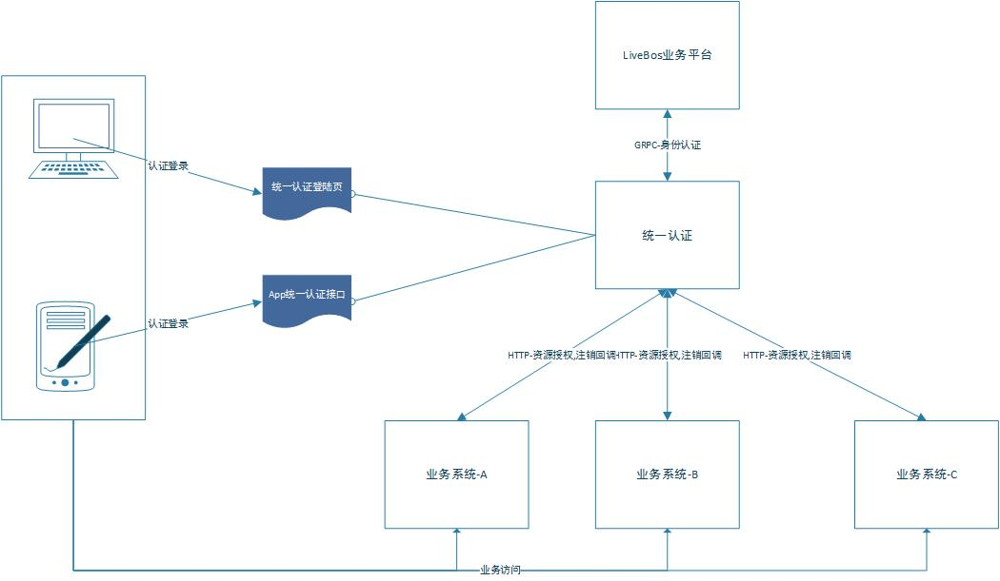
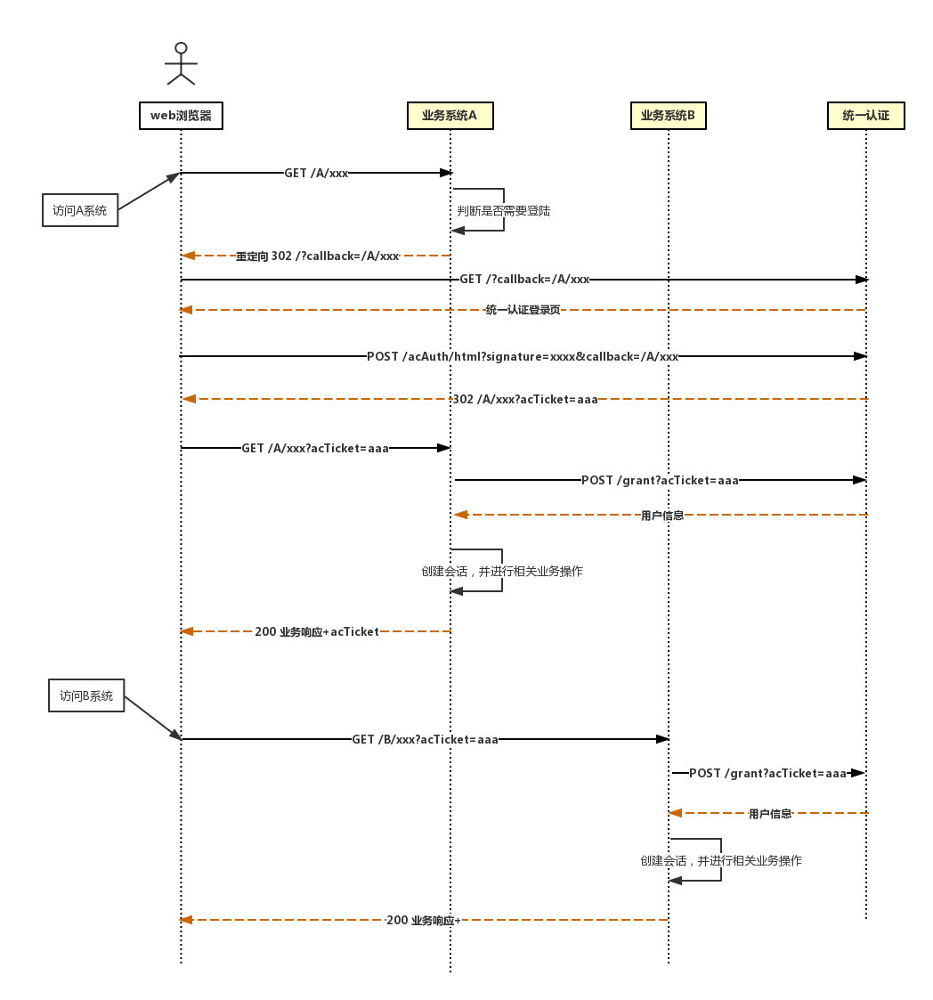
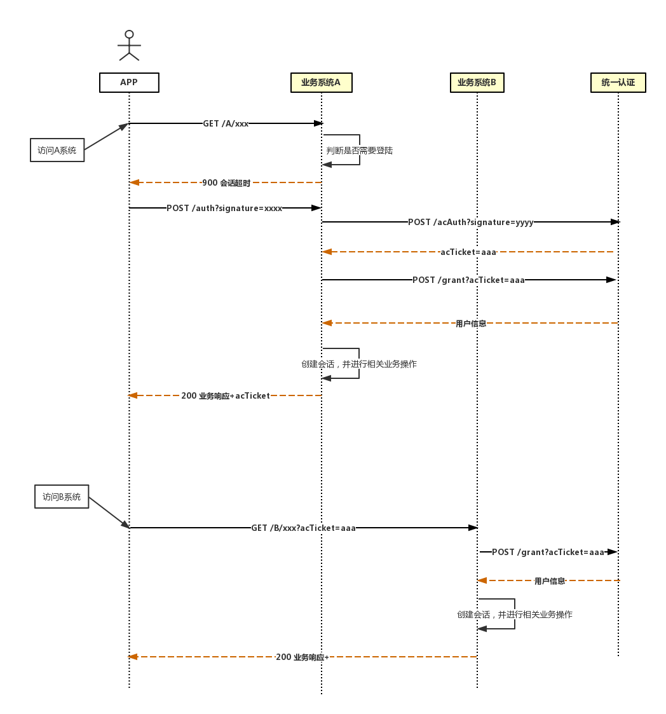
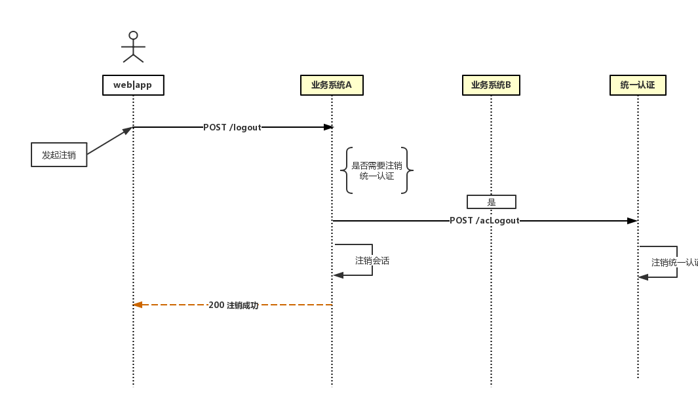
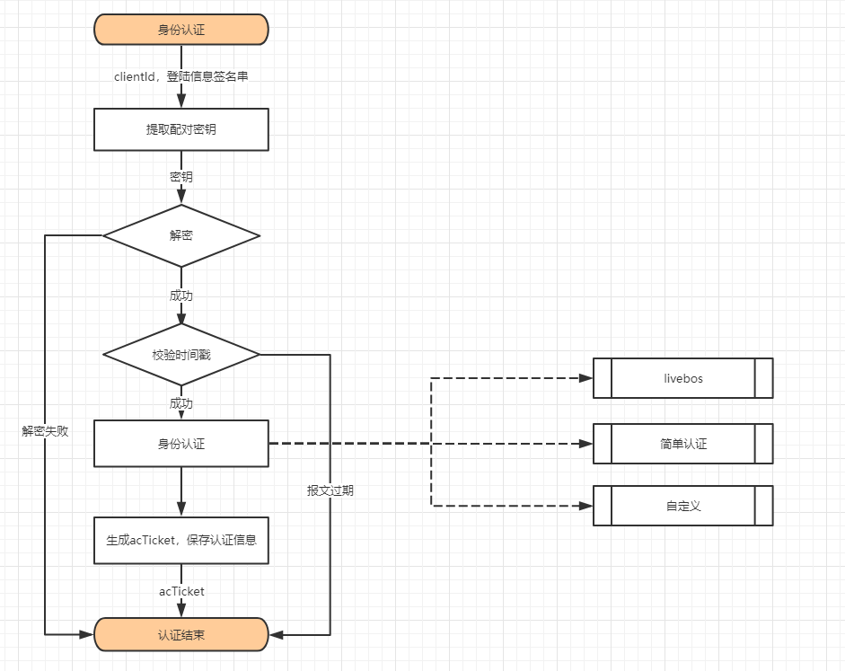
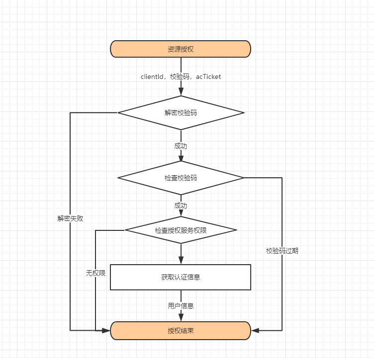
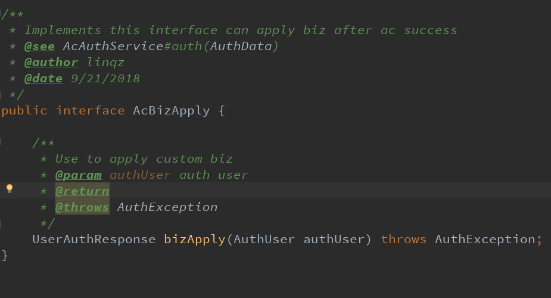

[【返回目录】](../README.md)
# 统一认证

## 概述
  统一认证是基于OAuth2.0规范用户身份认证抽象平台，满足企业级多系统协同工作的"单点登录"SSO要求。

  平台实现了身份认证系统公共部分,认证平台集群或者单节点状态下会话保持，多业务系统之间的认证信息共享，但不具体实现身份的认证逻辑，而是采用插件的形式，对接具体的身份认证服务。

  目前平台内置了LiveBos的微服务用户认证，同时使用者可以通过二次开发，实现自定义的身份认证。

## 系统框架
 - 整体架构



 - Web认证


 - App认证



 - 注销会话




 - 身份认证流程逻辑




 - 资源授权流程逻辑



## 部署
 - 环境准备
    1. JDK8
    2. 微服务集群相关环境
    3. LiveBos服务 （如果采用LiveBos认证模式的话）
 - 运行
    1. 拷贝jar包中的 application.yml，application-dev.yml，bootstrap.yml，log4j2.yml到jar包统同级目录，进行个性化修改
    2. 启动服务

    如果不指定log4j2.yml,会直接使用jar中的配置文件
    ```
    nohup java -Dlog4j.configurationFile=log4j2.yml -jar aas-authentication-center-1.0.0-SNAPSHOT.jar &

    ```

## 配置

统一认证配置

```yaml
    application:
      #应用名称，必须配置，集群中的应用名称必须一致
      name: aas.ac
    server:
      #服务端口
      port: 8080
    spring:
      thymeleaf:
        cache: false
      datasource:
          aasDs: #aas数据源 非必须
            name: main-mysql
            driver-class-name: com.mysql.cj.jdbc.Driver
            url: jdbc:mysql://xxx.xxx.xxx.xxx:3306/xx?useUnicode=true&characterEncoding=utf-8&useSSL=false&serverTimezone=GMT%2B8
            username: xxx
            password: xxx
            initialSize: 5
            maxActive: 20
            validationQuery: select 1
            testWhileIdle: true
            testOnBorrow: false
            testOnReturn: false
            poolPreparedStatements: true
            maxOpenPreparedStatements: 100
            filters: stat,wall
    aas:
      ac:
        kaptcha: #验证码配置
          enable: true #默认不启用验证码功能，为true开启
          expire: 10000 #验证码过期时间 默认60s
      swagger: #swagger插件
        enabled: true
        showDemo: false
      #认证模式配置 type可以simple和livebos
      authentication:
        enabled: true
        type: livebos
      #type=livebos  需要配置
      livebos:
        api-user: ws_user
        api-pwd: '000000'
        ams:
          enabled: true
          namespace: lbtest

```

统一认证客户端配置（当没有配置aas数据源时，需配置该项）

```yaml

   ac-clients:
     clients:
       aasTest02: #客户端id
         whiteIp: 127.0.0.1,192.168.81.238 #客户端ip白名单
         secret: "aasTest02" #客户端密钥
         name: "aas应用2" #客户端名称
       aasTest03:
         whiteIp: 192.168.81.238,127.0.0.1
         secret: "aasTest03"
         name: "aas应用3"

```


基于aas-spring-starter的应用接入统一认证

```yaml
   aas:
     authentication: #认证插件
       enabled: true
       type: ac
       #统一认证服务器（可不配置，不配置走微服务）
       ac-server: http://127.0.0.1:8081/
       #客户端密钥，必须
       secret: deb0064f-139d-437c-a9dd-6759c2f32a7b
       ams-enable: false #是否通过微服务调用
       logout-mode: 1 #登陆模式 0: 仅退出当前系统 1:退出当前系统和认证中心

```
## acTicket获取方式
    - web浏览器
        1.通过统一认证登录页登陆
        2.如果登陆成功，无需关注acTicket，将会自动传输
    - app接入
        1.通过主服务系统登陆接口进行登陆
        2.若登陆成功，acTicket将会通过响应报文返回
        3.将acTicket添加到url请求参数中即可登陆其他子系统或进行注销

## 自定义业务扩展

    可通过实现AcBizApply接口，在授权成功后的自定义业务扩展
    注意实现类需添加@Component注解
 

## 第三方集成
* 配置文件

        1.固定名称ac.properties
        2.可将配置文件放置在用户工作目录下（即user.dir）
        3.或将配置文件放到classpath类路径下
        4.优先读取用户工作目录下的配置文件，不存在将从类路径下获取
        
* 配置项
        
```properties
    #应用系统名称(必要)
    AcClient=aasTest02
    
    #当前系统登录模式，0-SSO，1-当前系统原有登录模式（即不进行任何SSO登录处理，主要用于应急处置），默认为0
    LoginMode=0
    
    #注销方式，0-退出SSO系统和当前系统，1-仅退出当前系统，默认为0
    LogoutMode=0
    
    #应用系统的登陆地址（必要）
    LoginUrl=/login
    
    #应用系统的注销地址（必要）
    LogoutUrl=/logout
    
    #sso登录加密密钥（必要，须由客户端与sso服务器端同时设置相同参数）
    AcSecret=deb0064f-139d-437c-a9dd-6759c2f32a7b
    
    #sso认证系统地址（必要）
    AcServer=http://linqz.com:8080

    #sso登录注销类 用于sso登录登出后应用系统的相关操作（必要，由应用系统实现，根据实际路径设置）
    #实现接口com.apexsoft.aas.ac.AcBizApply
    SSOHelperClass=com.apexsoft.aas.ac.DefaultAcBizApply
    
    #过滤器不过滤的url，多个请用逗号分开（非必要，根据应用系统实际情况设置）
    ExcludeUrl = /test

```

* 集成方式

> 提供springboot和mvc两种集成方式demo

`springboot方式`

创建FilterConfig类文件内容如下：

```java
    @Configuration
    public class FilterConfig {
        @Bean
        public FilterRegistrationBean acFilterRegistration() {
            FilterRegistrationBean registration = new FilterRegistrationBean(new AcFilter());
            registration.addUrlPatterns("/*");
            registration.setName("acFilter");
            registration.setOrder(1);
            return registration;
    
        }
    }
```

`mvc方式`

在web.xml中添加如下配置：

    <filter>
        <filter-name>acFilter</filter-name>
        <filter-class>com.apexsoft.aas.ac.filter.AcFilter</filter-class>
    </filter>

    <filter-mapping>
        <filter-name>acFilter</filter-name>
        <url-pattern>/*</url-pattern>
    </filter-mapping>
    
* 业务扩展

接入方可通过实现接口com.apexsoft.aas.ac.AcBizApply进行登陆、登出后的业务补偿

> 例如：可实现该接口，在登陆后进行权限获取操作

接口定义如下：
```java
    /**
     * @author linqz
     * @date 10/12/2018
     */
    public interface AcBizApply {
    
        /**
         * Login biz apply
         * @param user user info
         * @param request
         * @param response
         */
        void loginApply(JSONObject user, HttpServletRequest request, HttpServletResponse response);
    
        /**
         * Logout biz apply
         * @param request
         * @param response
         */
        void logoutApply(HttpServletRequest request, HttpServletResponse response);
    }
```

实现后通过ac.property配置文件的SSOHelperClass配置项指定类文件

> 例如：SSOHelperClass=com.apexsoft.aas.ac.DefaultAcBizApply


[【返回目录】](../README.md)