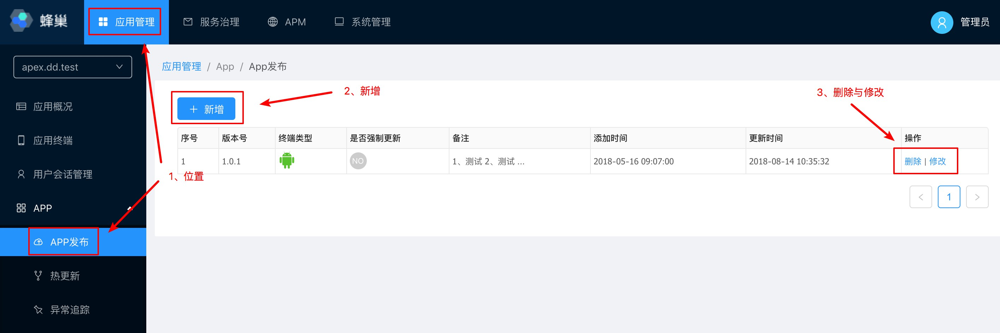
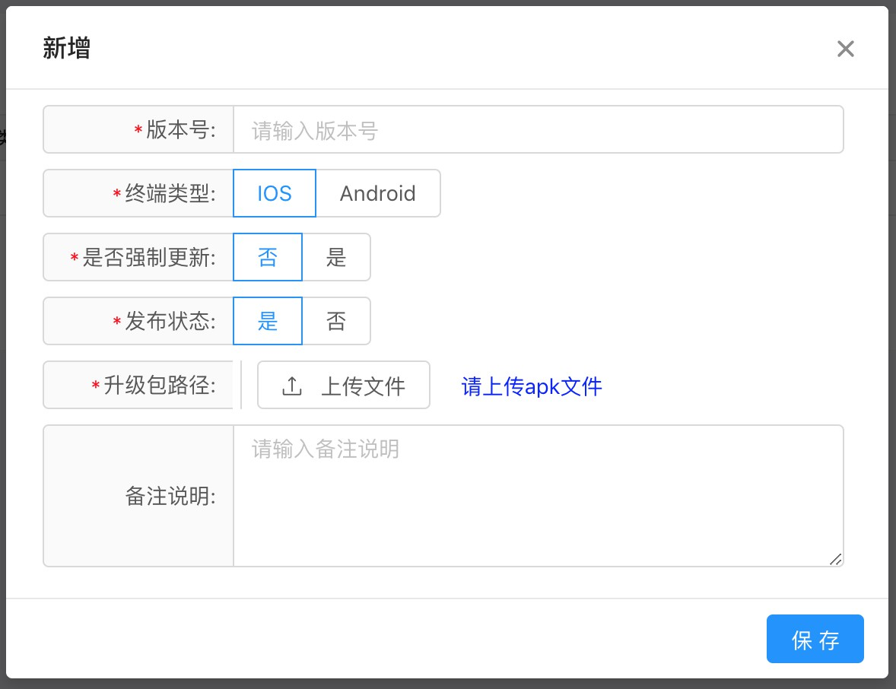
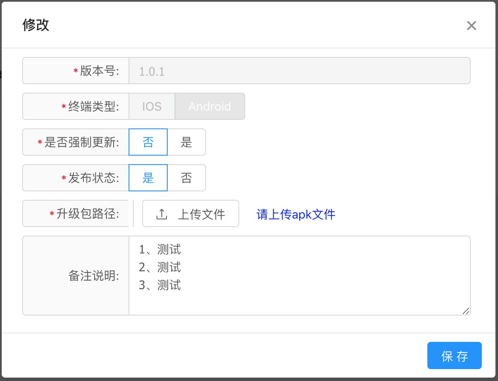
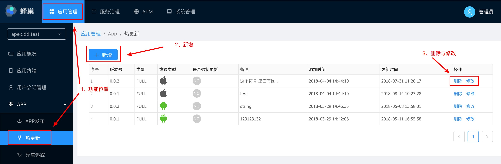
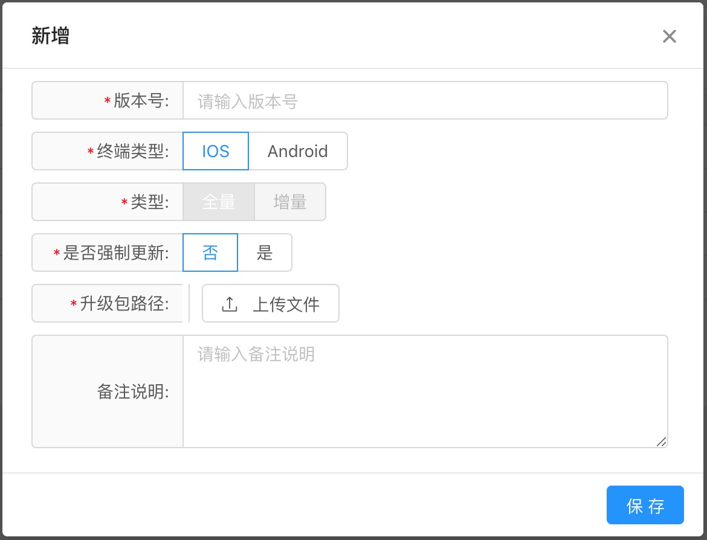
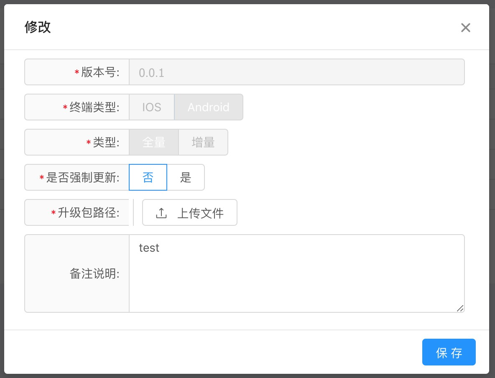
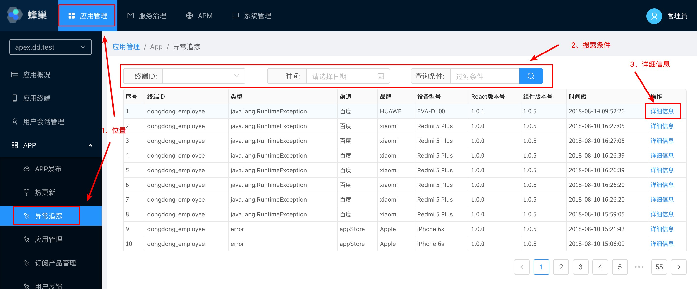
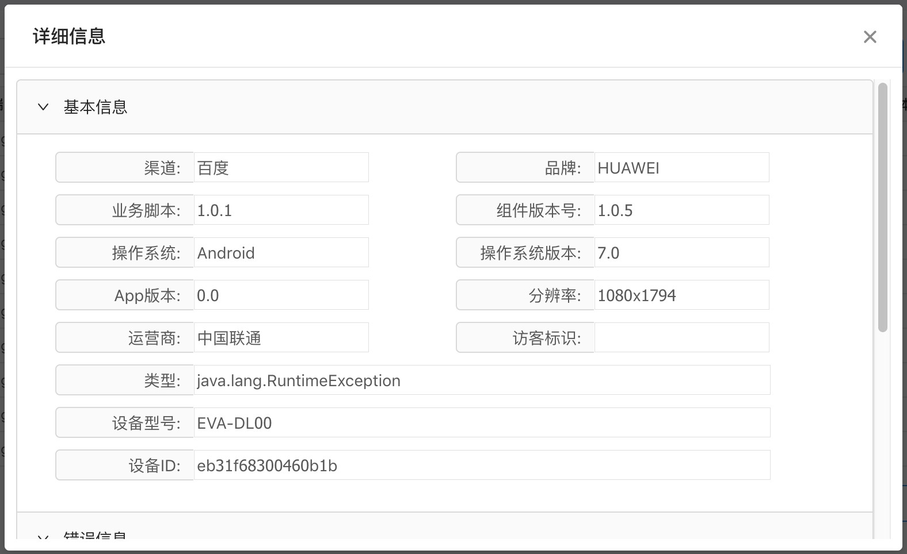
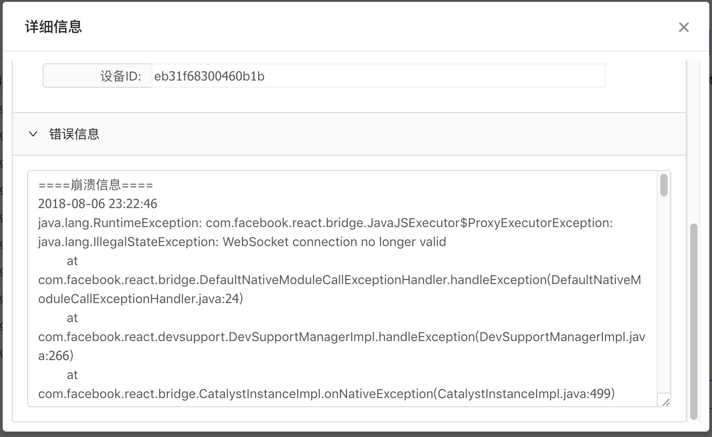

[【返回目录】](../README.md)

# 简介
应用管理菜单下的APP，主要是用于手机端应用的控制台管理。有以下功能：
1. App发布
2. 热更新
3. 异常追踪

# 操作说明
## 1、APP发布（原生应用版本管理）
手机应用版本发布管理。包含IOS和Android版本。在控制台新增版本并上传App应用的文件，可使用本平台内置的App发布功能。（二维码扫码和App下载请参照咚咚服务插件说明。）
菜单位置：应用管理->APP->APP发布

* **新增**
	1. 版本号：只能以`1.0.0`的格式进行填写，新增版本号时，只允许填写大与之前的最大版本，如当前发布的版本号为1.1.1，新增的版本号只能填写大与1.1.1的版本。
    2. 终端类型：可选择IOS或Android，默认为IOS。
    3. 是否强制更新：在App新打开使用时，会校验版本号，如果该选项为强制更新，则App强制要求升级到该版本。（注：全以当前最大的版本号进行校验）默认为否。
    4. 发布状态：新增App发布版本后，马上进行发布。默认为是。
    5. 升级包路径：该项为必填项，会根据终端类型提示上传相应的文件。`IOS`需要上传ipa文件和List文件，`Android`只需要上传apk文件。（注：文件大小不能超过200M）
* **修改**
	1. 修改时版本号与终端类型不允许修改
* **删除**
	1. 物理删除记录

## 2、热更新（RN应用版本管理）
维护手机应用的热更新版本。
菜单位置：应用管理->APP->热更新

* **新增**
	1. 版本号：只能以`1.0.0`的格式进行填写，新增版本号时，只允许填写大与之前的最大版本，如当前发布的版本号为1.1.1，新增的版本号只能填写大与1.1.1的版本。
    2. 终端类型：可选择IOS或Android，默认为IOS。
    3. 类型： 目前平台只提供全量选项。热更新时，全量更新
    4. 是否强制更新：在App新打开使用时，会校验版本号，如果该选项为强制更新，则App强制进行热更新。（注：全以当前最大的版本号进行校验）默认为否。
    5. 升级包路径：该项为必填项，上传ZIP的热更新文件。
* **修改**
	1. 修改时版本号与终端类型不允许修改
* **删除**
	1. 物理删除记录

## 3、异常追踪
手机应用崩溃后会往服务器发送崩溃日志，可使用该功能查找手机应用崩溃的原因。
菜单位置：应用管理->APP->异常追踪

* **条件查询**
	使用搜索条件进行崩溃日志查询。提供终端ID，崩溃日期和过滤条件等查询条件进行查询。
* **详细信息**
	详细信息包括基本信息和详细信息。
    1. 基本信息：列出手机应用崩溃时的基本信息。包括：渠道、品牌、组件版本号、操作系统、操作系统版本、App版本、分辨率、运营商、设备类型、设备ID等信息。
    2. 详细信息：列出手机应用崩溃时的错误日志。

[【返回目录】](../README.md)
