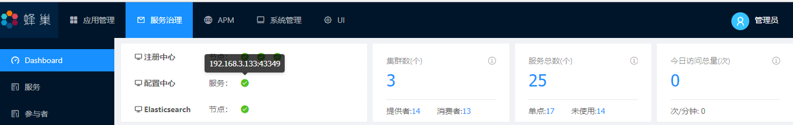
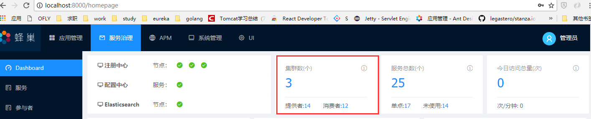
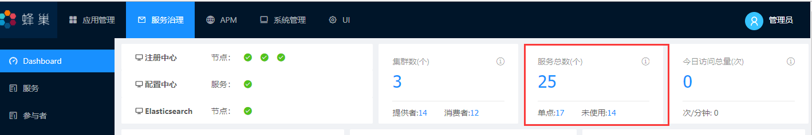
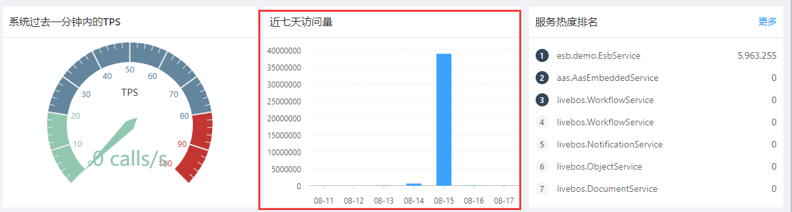
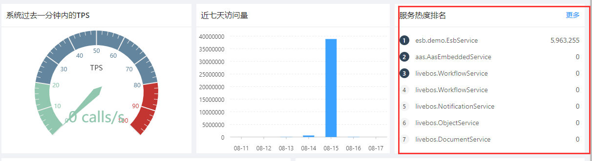

[【返回目录】](../README.md)

# 服务治理 》 Dashboard

## 基础说明：

监控微服务统计信息和注册中心配置中心状态

## 数据说明


### 1. 注册中心、配置中心、Elasticsearch 状态信息
> 
> 三者的状态信息, 能显示三者的ip和port信息

### 2. 集群数(个)

> 当前微服务提供的集群个数,数量和应用管理中监控页面
> 
>
> 
>
> - 提供者: zookeeper 路径/ams/{serviceId}/server or /ams/{namespace}/{serviceId}/server 所有提供者的合集
> - 消费者: zookeeper 路径/ams/{serviceId}/client or /ams/{namespace}/{serviceId}/client 所有提供者的合集

### 3.服务总数(个)

---
>  
>
> - 服务总数: zookeeper 路径/ams/{serviceId} or /ams/{namespace}/{serviceId} 中所有的服务总数
> - 单点:zookeeper 路径/ams/{serviceId}/server or /ams/{namespace}/{serviceId}/server 中所有的服务的提供者只有1个的合集
> - 未使用: zookeeper 路径/ams/{serviceId}/server or /ams/{namespace}/{serviceId}/server 中所有的服务的提供者只有0个的合集
## 5.今日访问总数(个)
> 今日访问总量: 根据今日的index(eg:metrics-2018-08-06) 对数据的increment字段进行sum聚合
> method: POST
>
> url: http://ip:port/{index}/_search
>
> headers
>
> - Authorization: {加密} (eg: Basic ZWxhc3RpYzphcGV4ZXM= ZWxhc3RpYzphcGV4ZXM= 为 name:password 的base64加密串)
> - Content-Type: application/json
>
> Body
>
> ``` json
> {
> 	"query":{
> 		"bool": {
> 			"must": [
> 				{
>                    "match": {
>                       "type": "timer"
>                     }
>                 }
> 			]
> 		}
>
> 	},
> 	"size": 0,
>     "aggs": {
>         "todayAccessCount": {
>             "sum": {
>                 "field": "increment"
>             }
>         }
>     }
> }
> ```
### 系统过去一分钟内的TPS
> tps: 根据metrics-* 对数据最近一分钟内的字段increment的sum聚合然后除以60
> method: POST
> url: http://ip:port/metrics-*/_search
> headers
>
> - Authorization: {加密} (eg: Basic ZWxhc3RpYzphcGV4ZXM= ZWxhc3RpYzphcGV4ZXM= 为 name:password 的base64加密串)
> - Content-Type: application/json
> Body
> ```json
> {
> 	"query":{
> 		"bool": {
> 			"must": [
> 				{
>                     "match": {
>                       "type": "timer"
>                     }
>                 }
> 			],
> 			 "filter": {
>                 "range": {
>                     "@timestamp": {
>                         "gt": "2018-08-14T05:36:31",
>                         "lte": "2018-08-14T05:37:31"
>                     }
>                 }
>             }
> 		}
>
> 	},
> 	"size": 0,
>     "aggs": {
>         "accessCount": {
>             "sum": {
>                 "field": "increment"
>             }
>         }
>     }
> }
> ```
### 近七天访问量
> 
> 和查询今日访问总量一样, 只是index 换成是对应的前6天外加今天的访问总量形成近七天访问量

### 服务热度排行
> 
>
> 对zookeeper存在的服务和serverId 对 es 数据 name 和serverId 进行过滤 查询出最近的当前时间内的count 到内存中缓存.
>
> 由于数据存储的结构是对服务内方法的统计,所以还需要在内存中对同一个服务不同方法进行数据汇总,在对数据进行排序得出访问排行前7的服务名称

### 今日访问量
> 和今日访问总数(个)差不多，在这个的基础上加上时间范围的过滤@timestamp形成24小时的访问柱状图

### 系统平均响应时间
> 和今日访问总数(个)差不多, 在这个基础上加上时间范围过滤@timestamp 最近10分钟的mean和increment相乘得到总的访问时间，再除以全部的increment综合 形成系统10分钟内的平均响应时间

[【返回目录】](../README.md)
