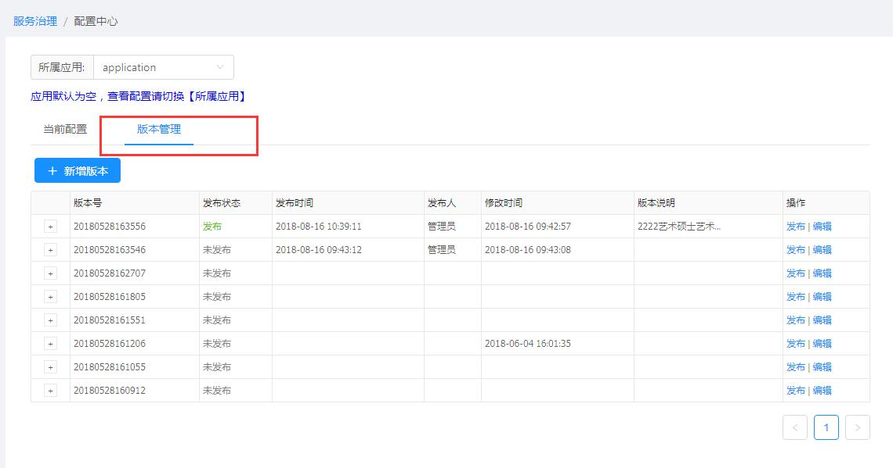
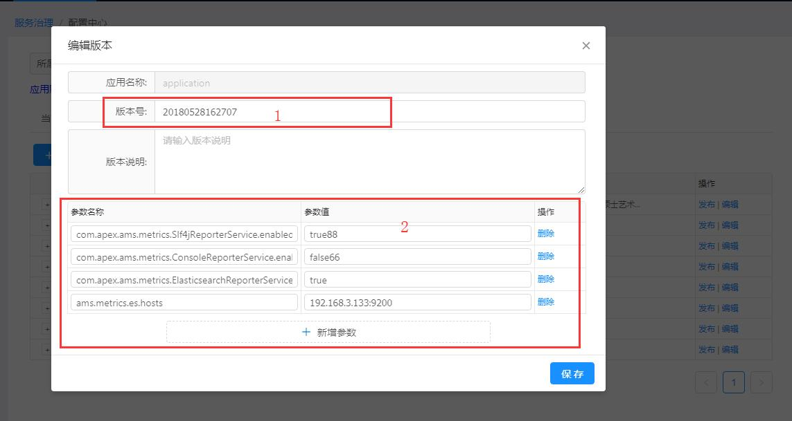

[【返回目录】](../README.md)

# 配置中心操作手册 #
对配置中心数据进行维护管理

- 初始页面：进入配置中心，初始没有数据，需要先选择应用再展示对应的配置数据

- 应用配置查看：选择所属应用，展示对应的配置数据。
	- 当前配置：当前生效的配置
	
	- 版本管理：当前应用配置可以有多个版本，同时只能发布、生效一个版本
	
- 新增、修改配置版本
	- 步骤说明： 先任意选择一个所属应用，切换到版本管理tab界面，点击“新增版本”，弹出新增版本弹出框。
	- 要素说明：
		- 产品ID：应用唯一标识ID，新增版本时不可编辑
		- 版本号：系统会根据当前日期时间生成一个默认版本号，也可手动修改
		- 版本说明：当前版本的说明、描述
		- 参数：默认加载当前发布配置的所有参数，可在此配置的所有参数基础上对参数进行新增、编辑、删除

- 新增应用配置
  在所属应用下拉选项中找不到应用【说明：默认都会有名称为application的应用】，需要新增应用配置。
	- 步骤说明： 先任意选择一个所属应用，切换到版本管理tab界面，点击“新增版本”，弹出新增版本弹出框，点击“新增应用”。
	- 要素说明：
		- 产品ID：应用唯一标识ID
		- 版本号：系统会根据当前日期时间生成一个默认版本号，也可手动修改
		- 版本说明：当前版本的说明、描述
		- 参数：根据应用需要用到的各个配置新增参数、参数值

- 版本发布
	- 步骤说明： 先任意选择一个所属应用，切换到版本管理tab界面，选择对应的版本，点击“发布”，会弹出发布确认提示框，点击确认，发布生效。

[【返回目录】](../README.md)
