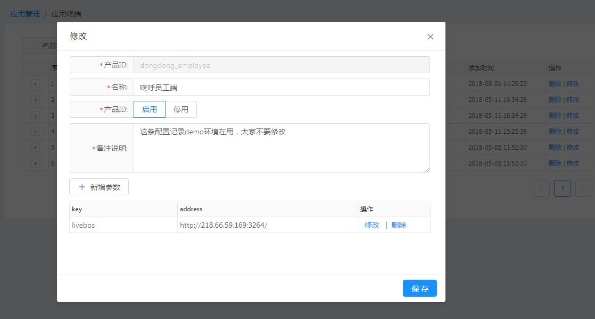

[【返回目录】](../README.md)

# 应用终端操作手册 #
配置终端接入应用的ID和秘钥，终端ID和秘钥配对存在，前端在登录的时候需要传终端ID和使用秘钥加密的签名串验证登录信息。【认证详细可参考 AAS开发指导-插件使用说明-Session控制 的内容说明】

- 列表
	- 1 名称模糊查询
	- 2 点击+号可查看配置参数

- 新增、修改
	要素说明：
	- 终端ID：接入应用终端的唯一标识，修改时，终端ID不能编辑
	- 秘钥：系统根据终端ID生成，不需人工输入
	- 名称：终端名称
	- 状态：是否启用、允许终端接入应用
	- 备注：对接入终端的描述
	- 新增参数：配置子域名。如果前端需要访问多个系统，子域名配置在这里

[【返回目录】](../README.md)
