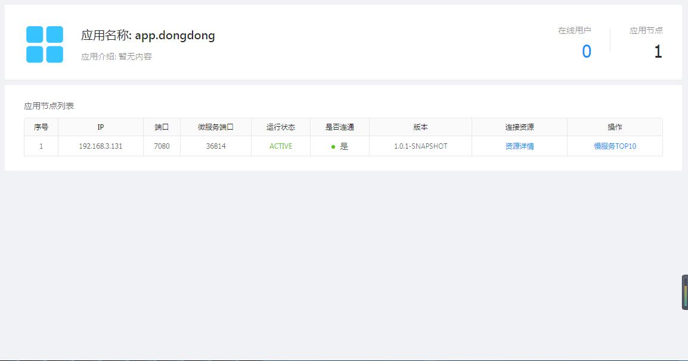
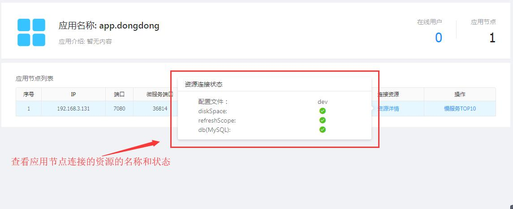
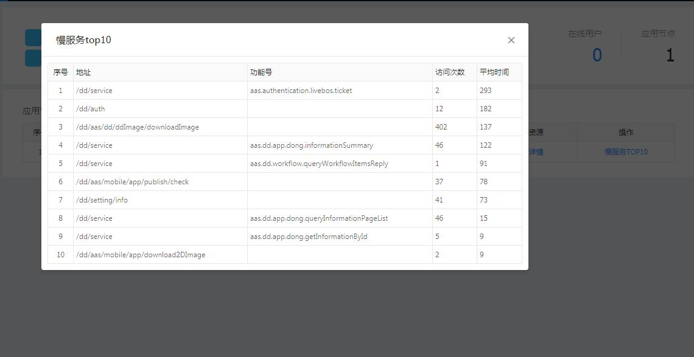

[【返回目录】](../README.md)

# 应用概况操作手册 #
查看当前应用名称、在线用户汇总数量、应用节点汇总数量以及每个节点的相关信息。

- 应用列表
	- ip: 节点所在服务器的ip地址
	- 端口：节点占用的http端口
	- 微服务端口：节点占用的微服务端口
	- 运行状态：节点的运行状态
	- 是否连通：节点是否能连通，可能因为网络、防火墙问题，没办法访问到该节点，就不能连通
	- 版本： 节点所使用的ass-spring-boot-starter 的版本
	- 连接资源： 查看节点连接的相关资源，比如db、redis等...
		
	- 慢服务TOP10：查看节点servlet服务平均响应时间最慢的10个
		

[【返回目录】](../README.md)
