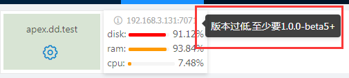

[【返回目录】](../README.md)

# 应用管理首页
## 基础介绍：
每隔10秒钟请求最新的服务器基础状态,包括内存、磁盘和cpu和状态。
## 显示权限:
admin：能查看到所有服务器

非admin用户: 需要admnin用户去 【系统管理》操作人员】进行应用授权。

##出现问题：
 1.**状态分为正常和非正常。**

> 非正常的当前版本只涉及到2个,
>
>  1.1. 
>
> 当前服务器的提供的服务版本过低
> 查看 打包服务的项目libraries.gradle文件的aasVersion 是否满足提示的要求
> 
>
> 1.2.服务访问不了微服务。检测不通的过程是当前监控平台去当问该服务器提供服务的检测状态的微服务，尝试不通。可能的原因有服务器版本过低,还有的就是设置了防火墙导致控制台访问不了该服务器

2.**服务器启动了却在监控首页没发现监控的服务器**
>  1.1 检测zookeeper 地址是否连接的和监控平台一致
>
> 1.2 检查zookeeper路径 /ams/aas/aas.AasEmbeddedService/server 下是否有对应的服务器的ip+amsPort
>
> 没有的话，则服务器启动失败，有的话，再检查zookeeper路径/amc/server 路径下是否有对应的服务器ip+amsPort
>
> 没有的话，则服务器注册失败，有的话，一般都能出现再监控首页

[【返回目录】](../README.md)
