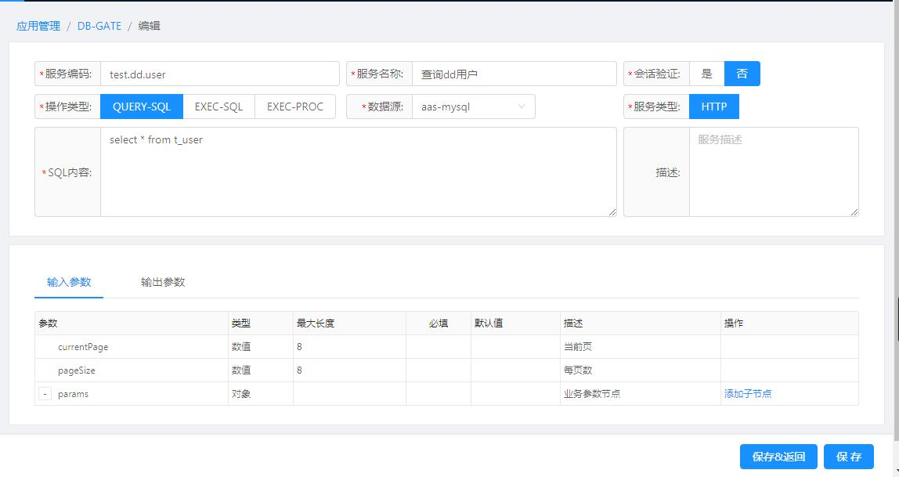
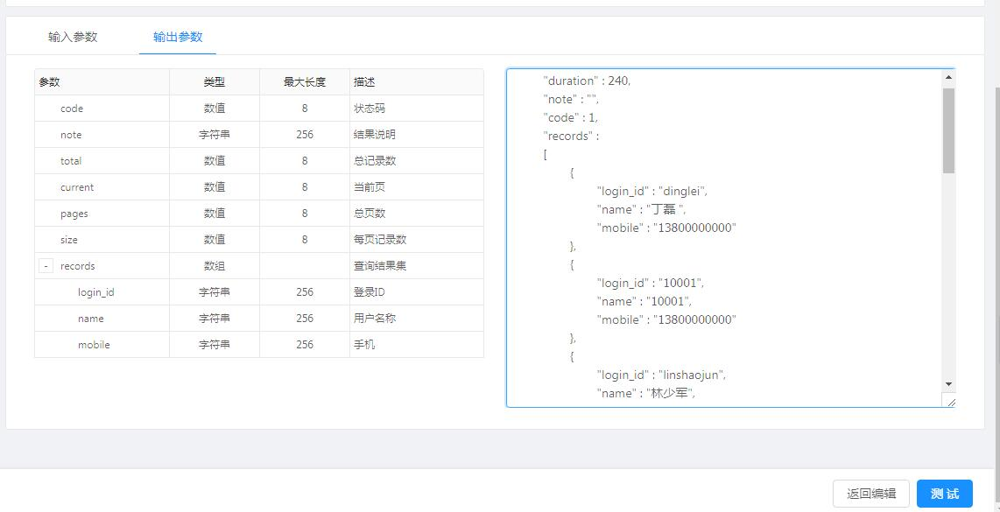

[【返回目录】](../README.md)

# db-gate操作手册 #
DB-GATE，将SQL或存储过程通过配置转换为restful服务,支持数据库 Oracle,MYSQL,SQL调用 insert,delete,update,select,过程调用call test.getData()
服务调用方式支持restful
> 例如：curl -X POST --header 'Content-Type: application/json' --header 'Accept: application/json' --header 'func: sql.query' --header 'version: 1.0' -d '{ \ "params": [ \ "1" \ ] \ }' 'http://localhost:8080/service/fsdp/sql.query'

- **总服务数**: 当前应用下的所有db-gate服务数量
- **在线服务数**: 状态为启用的db-gate服务数量


## 1. 服务条件查询 ##
	- 数据源：展示当前应用配置的所有数据源（application-xx.yml）,下拉选择过滤；
	- 关键字：根据功能号或者功能名称，模糊匹配搜索；
	- 排  序：可根据功能号的英文字母（按a-z正序或者逆序）、更新时间排序。


## 2. 服务新增、编辑 ##
	### 要素说明： ###
	- 服务编码：即服务ID，唯一，必填
	- 服务名称：服务的中文名称，必填
	- 会话验证：服务是否需要验证会话才能调用
	- 操作类型：

	      - QUERY-SQL：用于查询数据
    	  > 语句示例： 1：select * from table where colunm2=?

    	  - EXEC-SQL：用于更新或删除数据
    	   > 语句示例： 1：update table set column1=? where colunm2=? 2：delete from table where clounm1=?

    	  - EXEC-PROC：用于调用存储过程,其中出参也需要?占位
    	   > 语句示例： 1：call test(?,?,?)
	- 数据源: 选择服务要对哪个数据源进行操作
	- 服务类型：目前只支持http类型
	- sql内容：根据操作类型写当前服务要执行的sql语句
	- 描述：服务执行功能的描述
	- 输入参数：
	   - 参数：参数名称
       - 类型：参数类型，输入参数类型只有字符串、数值
       - 最大长度：参数的最大长度，当类型为字符串时才需要
       - 必填：参数是否必填
       - 默认值：当参数为必填时，才需要
       - 描述：参数的中文名称或者说明
    - 输出参数：
		- 参数：参数名称
		- 类型：参数类型，输出参数类型有字符串、数值、数组、对象
		- 最大长度：参数的最大长度，当类型为字符串时才需要
		- 描述：参数的中文名称或者说明


```yaml
类型为QUERY-SQL
入参格式：
├── currentPage                    // 当前页，数值，固定入参
├── pageSize                       // 每页数，数值，固定入参
└── params                         // 业务参数节点，对象，可添加自定义子节点
    ├── [自定义子节点参数]
    └── [自定义子节点参数]
出参格式：
├── code                    // 状态码，数值，固定出参
├── note                    // 结果说明，字符串，固定出参
├── pageSize                // 每页数，数值，固定出参
├── currentPage             // 当前页，数值，固定出参
├── totalPage               // 总页数，数值，固定出参
├── totalRecord             // 总记录数，数值，固定出参
└── records                 // 查询结果集，对象，可添加自定义子节点
    ├── [自定义子节点参数]
    └── [自定义子节点参数]
```

```yaml
类型为EXEC-SQL
入参格式：
└── params                  // 业务参数节点，对象，可添加自定义子节点
    ├── [自定义子节点参数]
    └── [自定义子节点参数]
出参格式：
├── code                    // 状态码，数值，固定出参
├── note                    // 结果说明，字符串，固定出参
└── execCount               //处理记录数，对象，固定出参
```


```yaml
类型为EXEC-PROC
入参格式：
└── params               // 业务参数节点，对象，可添加自定义子节点
    ├── [自定义子节点参数]
    └── [自定义子节点参数]
出参格式：
├── code                 // 状态码，数值，固定出参
├── note                 // 结果说明，字符串，固定出参
└── data                 // 查询结果集，对象，可添加自定义子节点
    ├── [自定义子节点参数]
    └── [自定义子节点参数]
```




## 3. 服务测试 ##
   测试服务的连通性，数据是否正确返回



## 4. 服务备份、还原 ##

	- 备份：导出该应用下的所有dbgate服务
	- 还原：选择pkg文件导入服务


## 5. 服务删除 ##
   通过服务列表的编辑功能按钮进入编辑页面，在编辑页面的右下角的删除按钮进行删除


[【返回目录】](../README.md)
