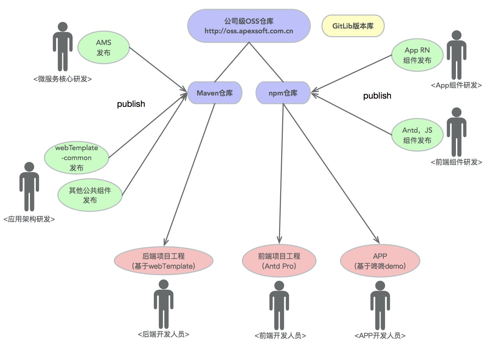

[【返回目录】](../README.md)

# 开发协作模式



## GitLab
- Git版本管理工具再业内已经得到越来越广泛的使用，跟SVN相比有很多优势。公司已部署公共‘Gitlab’环境，访问地址`https://git.apexsoft.com.cn`。Gitlab环境公司员工实名访问，账号申请通过公司OA发起`GitLab账号申请`流程；
  > 每个部门由“部门安全专员”创建项目分组，负责分组成员角色和权限，分组和项目的授权各自联系自己部门安全专员；

## OSS仓库
- Nexus Repository私有仓库在模块化开发、API版本发布、团队协作、提升开发效率方面提供强大的工具支持。公司已部署了`OSS`公共仓库，访问地址`http://oss.apexsoft.com.cn`。OSS仓库公司员工实名访问，账号申请通过公司OA发起`OSS账号申请`流程；
  > Maven仓库：java技术栈API代码发布平台。技术研发中心、应用架构产品部发布公共的API代码到maven仓库，业务线项目开发基于webTemplate引用相关模块；

  > npm仓库：JS包管理发布平台。技术研发中心、应用架构产品部发布RN,antd组件到npm库，业务线APP项目基于"咚咚"移动应用框架引用相关组件模块；

### 如何在Gradle中设置OSS用户配置
```
# gradle默认工作目录在%user_home%/.gralde目录下，在此目录下创建文件gradle.properties，并设置以下变量：
NEXUS_USER=user
NEXUS_PASSWORD=******
```

[【返回目录】](../README.md)
