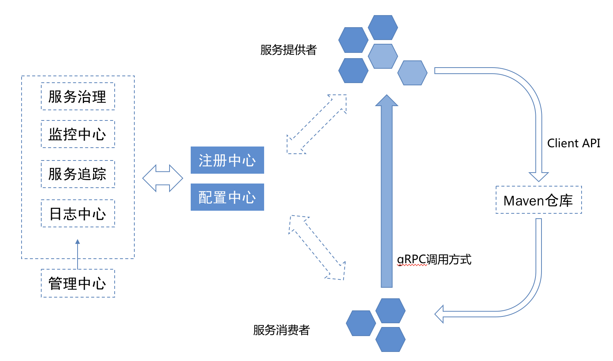

[【返回目录】](../README.md)
# 第一个微服务



* 根据微服务架构原理，`注册中心`是微服务架构中的必要组件，因此在开发和调试微服务必须先部署注册中心组件；
* 以下步骤以helloworld-module为例进行讲解；

## 部署注册中心
> `AMS`注册中心是基于zookeeper来实现的(我们简称为zk)，因此开发环境只需部署一个zk即可，生产环境要求部署zk集群。

##### zk下载地址
http://zookeeper.apache.org/releases.html

##### 运行配置
conf目录下提供了配置的样例zoo_sample.cfg，要将zk运行起来，需要将其名称修改为zoo.cfg。
打开zoo.cfg，可以看到默认的一些配置。

* tickTime
  * 时长单位为毫秒，为zk使用的基本时间度量单位。例如，
    * 1 tickTime是客户端与zk服务端的心跳时间，
    * 2 tickTime是客户端会话的超时时间。tickTime的默认值为2000毫秒，更低的tickTime值可以更快地发现超时问题，但也会导致更高的网络流量（心跳消息）和更高的CPU使用率（会话的跟踪处理）。
* clientPort
  * zk服务进程监听的TCP端口，默认情况下，服务端会监听2181端口。
* dataDir
  * 无默认配置，必须配置，用于配置存储快照文件的目录。如果没有配置dataLogDir，那么事务日志也会存储在此目录。

##### 启动
在Windows环境下，直接双击zkServer.cmd即可。在Linux环境下，进入bin目录，执行命令

`./zkServer.sh start`

这个命令使得zk服务进程在后台进行。如果想在前台中运行以便查看服务器进程的输出日志，可以通过以下命令运行：

`./zkServer.sh start-foreground`

执行此命令，可以看到大量详细信息的输出，以便允许查看服务器发生了什么。

## 微服务接口定义
AMS采用grpc作为通讯协议，因此定义一个接口服务需要定义proto文件，参考`ams-protocol/src/main/proto`目录下的helloworld.proto文件：
```
syntax = "proto3";
package first.demo;
option java_multiple_files = true;
option java_package = "com.apex.ams.helloworld";
//服务
service HelloworldService {
    //方法定义
    rpc firstService (HelloRequest) returns (HelloResponse) {}
}
//请求消息
message HelloRequest {
    string func = 1;
    string name = 2;
    string header = 3;
    string body =4;
}
//响应消息
message HelloResponse {
    int32 code = 1;
    string note = 2;
    int32 count = 3;
    repeated Record records = 4;
}
//结果集对象消息
message Record{
    int32 id = 1;
    string rowCode = 2;
    string rowName = 3;
}
```
编译ams-protocol模块生成grpc的java代码，生成的源码见目录`ams-protocol/generatedSrc`

## 怎么写一个微服务
参考`helloworld-module/src/main/java/com/apexsoft/provider/HelloAmsProducer.java`
```
package com.apexsoft.provider;
import com.apex.ams.common.CommonResponse;
import com.apex.ams.helloworld.HelloRequest;
import com.apex.ams.helloworld.HelloResponse;
import com.apex.ams.helloworld.HelloworldServiceGrpc;
import com.apex.ams.helloworld.Record;
import com.apex.ams.server.AmsService;
import io.grpc.stub.StreamObserver;
import org.slf4j.Logger;
import org.slf4j.LoggerFactory;
import java.util.UUID;

@AmsService(version = "1.0.0")
public class HelloAmsProducer extends HelloworldServiceGrpc.HelloworldServiceImplBase{

    private static final Logger log = LoggerFactory.getLogger(HelloAmsProducer.class);

    public void firstService(HelloRequest req, StreamObserver<HelloResponse> responseObserver){
        HelloResponse.Builder builder = HelloResponse.newBuilder();
        try {
            int count = 5;
            builder.setCode(1).setNote("[hello]ok").setCount(count);
            for(int i=1;i<=count;i++){
                Record record = Record.newBuilder()
                        .setId(i)
                        .setRowCode("行：rowCode:"+ UUID.randomUUID().toString())
                        .setRowName("行：rowName:"+UUID.randomUUID().toString())
                        .build();
                builder.addRecords(record);
            }
            builder.setCount(count);
        }catch(Exception e){
            e.printStackTrace();
            log.error(e.getMessage());
            builder.setCode(-1).setNote("[esb]error:"+e.getMessage());
        }finally {
            HelloResponse resp = builder.build();
            responseObserver.onNext(resp);
            responseObserver.onCompleted();
        }
    }
}
```

## 怎么调用微服务
参考`helloworld-module/src/main/java/com/apexsoft/consumer/HelloAmsConsumer.java`
```
package com.apexsoft.consumer;
import com.alibaba.fastjson.JSON;
import com.alibaba.fastjson.JSONObject;
import com.apex.ams.annotation.AmsBlockingStub;
import com.apex.ams.helloworld.HelloRequest;
import com.apex.ams.helloworld.HelloResponse;
import com.apex.ams.helloworld.HelloworldServiceGrpc;
import com.google.protobuf.util.JsonFormat;
import org.slf4j.Logger;
import org.slf4j.LoggerFactory;
import org.springframework.stereotype.Service;

@Service
public class HelloAmsConsumer {

    private static final Logger log = LoggerFactory.getLogger(HelloAmsConsumer.class);

    //通过注解的方式注入grpc客户端调用对象
    @AmsBlockingStub
    private HelloworldServiceGrpc.HelloworldServiceBlockingStub stub;

    public JSONObject doService(){
        try {
            HelloRequest req = HelloRequest.newBuilder()
                    .setFunc("603383")
                    .setName("顶点软件")
                    .setHeader("{'token':'xxxxxxxxxx'}")
                    .setBody("{'name':'应用架构研发'}")
                    .build();
            HelloResponse resp = stub.firstService(req);
            return JSON.parseObject(JsonFormat.printer().print(resp));
        }catch(Exception e){
            e.printStackTrace();
            log.error(e.getMessage());
            JSONObject result = new JSONObject();
            result.put("code",-1);
            result.put("note",e.getMessage());
            return result;
        }
    }
}
```

## demo运行
为了方面看到运行结果，我们编写一个Controller，用来在浏览器端看到运行结果
```
@RestController
@RequestMapping("/")
public class DemoController {

    @Autowired
    private HelloAmsConsumer amsSvc;

    @RequestMapping("/ams")
    public String ams() throws Exception{
        return amsSvc.doService().toJSONString();
    }
```
启动helloworld模块，通过浏览器输入地址`http://localhost:8080/ams`看到以下结果：
```
{
    "note": "[hello]ok",
    "code": 1,
    "records": [
        {
            "rowName": "行：rowName:0571027b-7b82-43bc-8a9e-cc60ae33dbb4",
            "rowCode": "行：rowCode:ca4d185e-6499-4576-ac02-819ae48d8627",
            "id": 1
        },
        {
            "rowName": "行：rowName:a6e22c65-252f-4ffe-99ef-cbb980484d34",
            "rowCode": "行：rowCode:e1e8a82d-25b4-4c38-ad19-25e8fd145c53",
            "id": 2
        },
        {
            "rowName": "行：rowName:af32cc00-2bc9-4536-a6a2-6ba27fbe581e",
            "rowCode": "行：rowCode:dc88095d-a53f-4819-a3e7-dbe48b80d3ac",
            "id": 3
        },
        {
            "rowName": "行：rowName:3482d780-eb66-42a3-b24f-0b1d58ce0fc4",
            "rowCode": "行：rowCode:0e3c7897-1663-4a80-926d-9f816604e17b",
            "id": 4
        },
        {
            "rowName": "行：rowName:729c84f8-f083-4954-9a45-92f6199507a8",
            "rowCode": "行：rowCode:c5f5cb01-9d0c-4e8d-847a-ded918fe083f",
            "id": 5
        }
    ],
    "count": 5
}
```

> 以上过程我们在一个模块中写了一个微服务，并且通过客户端去调用。实际上在启动进程的时候，helloworld微服务是注册到注册中心，客户端通过从注册中心自动发现服务，并通过服务名实现的调用过程，而不是本地方法调用。

[【返回目录】](../README.md)
