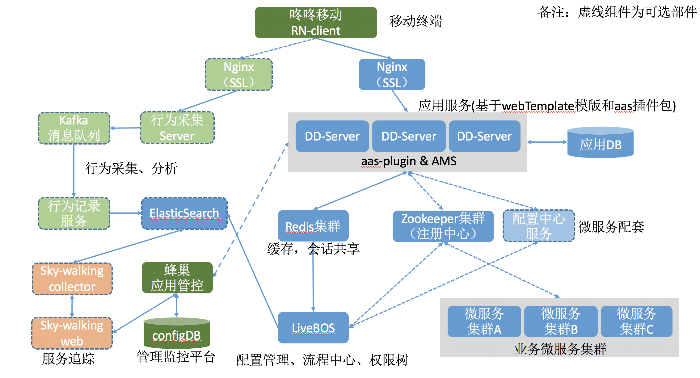
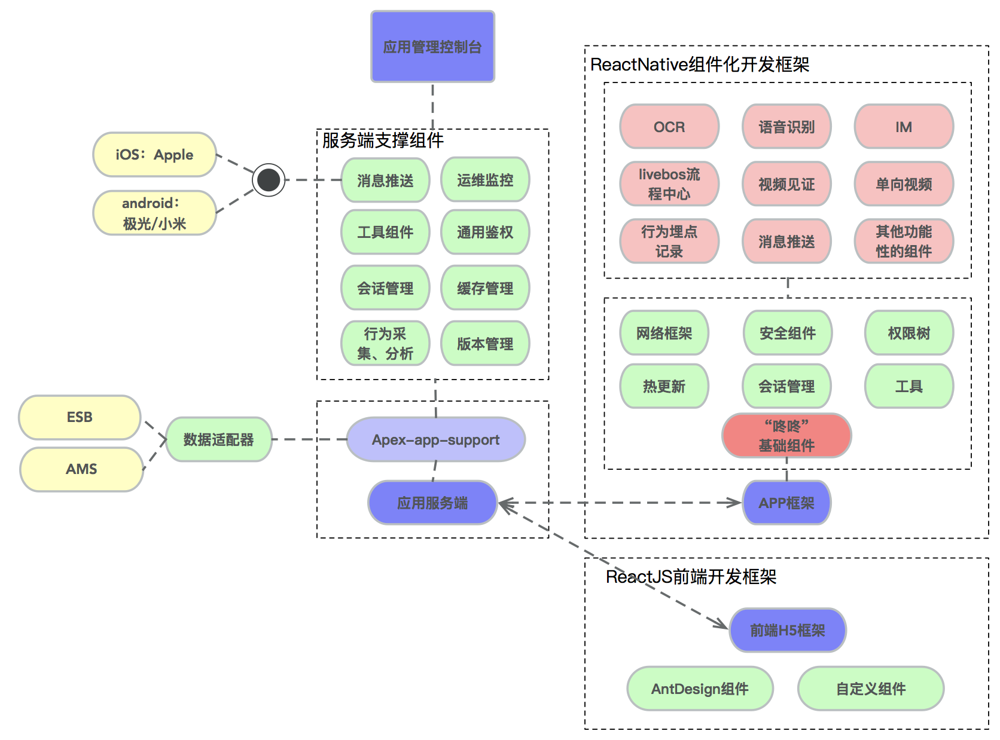

[【返回目录】](../README.md)
## 整体部署框架图 ##

#### 必选套件
- 咚咚手机客户端
- web服务端
- 微服务配套设施（包含zk集群，redis集群，es集群）
- 业务微服务集群
- `蜂巢`管理监控平台
- LiveBOS

#### 可选套件
- 行为采集和分析套件；
- 服务最终套件；
- 微服务配置中心；

## AMS微服务架构组成原理

## '咚咚'架构组成

[【返回目录】](../README.md)
