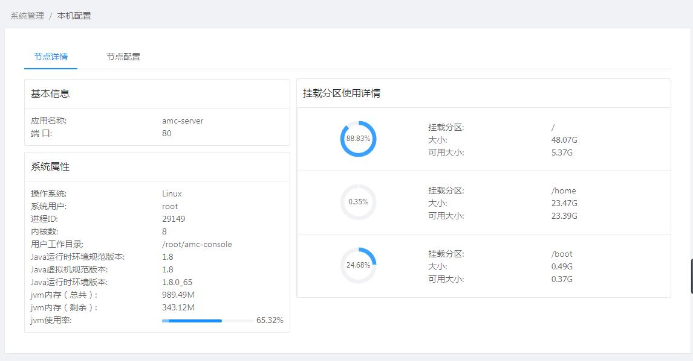
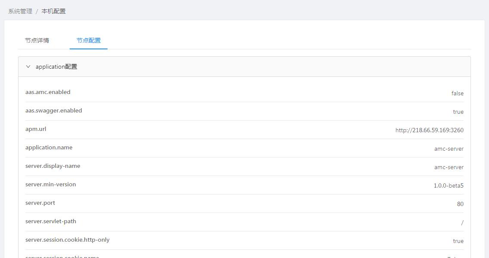
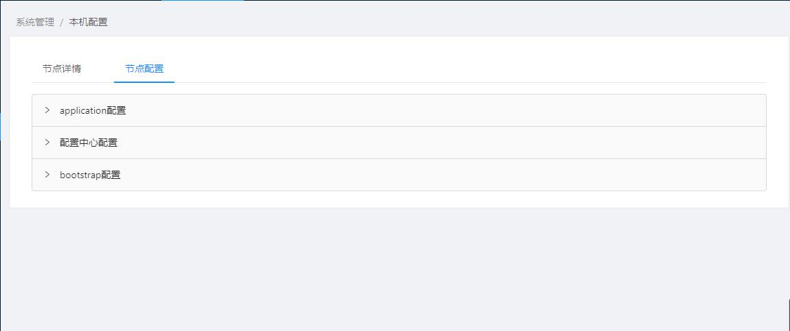

[【返回目录】](../README.md)

# 本机配置操作手册 #
查看amc控制台本身服务的配置和所在服务器的相关信息。

- 节点详情：查看amc控制台服务的应用名称、端口，以及所在服务器操作系统的系统用户、工作目录、进程ID、java环境信息、jvm使用情况、挂载分区使用情况。

- 节点配置:查看amc控制台服务所使用的配置文件内容，包括application-xx.yml，bootstrap.yml、配置中心的配置

[【返回目录】](../README.md)
