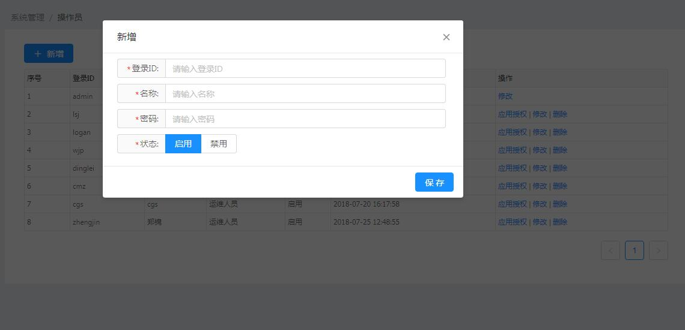

[【返回目录】](../README.md)

# 操作人员-操作手册 #
amc-console的运维人员管理。

## 列表 ##
- 序号
- 登录ID：运维人员登录的账号
- 姓名： 登录控制台显示的运维人员名称
- 用户类型:管理员或者运维人员
- 状态：启用或者禁用;禁用状态运维人员无法登录控制台
- 更新时间：运维人员用户信息最新修改的时间
- 操作：*运维人员没有对其他运维人员操作的权限*
	- 应用授权： 对运维人员授权可运维的应用
	- 修改： 修改运维人员的名称、密码、状态
	- 删除： 删除运维人员

管理员列表视图

运维人员列表视图

## 新增 ##
- 字段说明：
	- 登录ID： 运维人员登录的账号
	- 名称： 登录控制台显示的运维人员名称
	- 密码： 运维人员登录的密码
	- 状态： 运维人员账号状态

## 修改 ##
- 字段说明：
	- 登录ID： 运维人员登录的账号,不可修改
	- 名称： 登录控制台显示的运维人员名称
	- 密码： 运维人员登录的密码，密码为空，不输入即密码不会修改
	- 状态： 运维人员账号状态

## 应用授权 ##
对运维人员授权应用的权限，有对应应用的权限运维人员登录控制台才能查看、操作应用下的相关内容。

## 删除 ##
删除运维人员。删除前会有确认删除确认框提示

[【返回目录】](../README.md)
