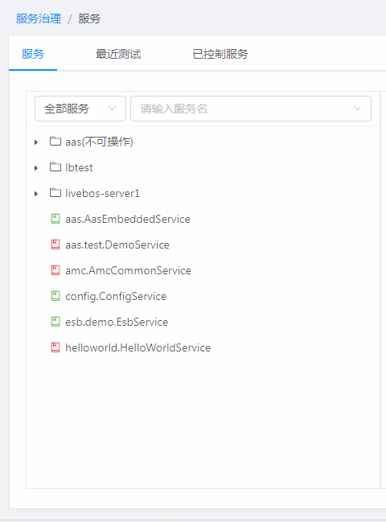
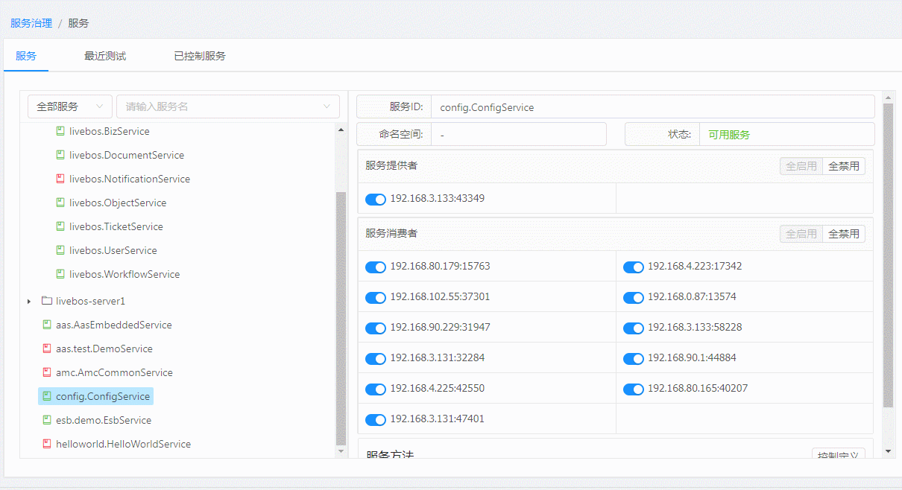
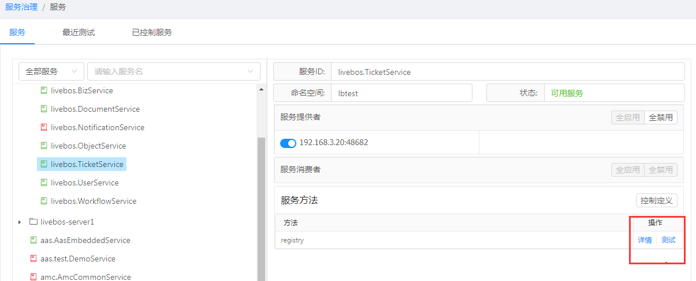
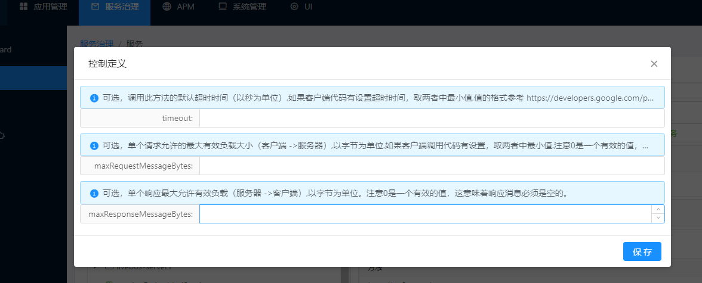
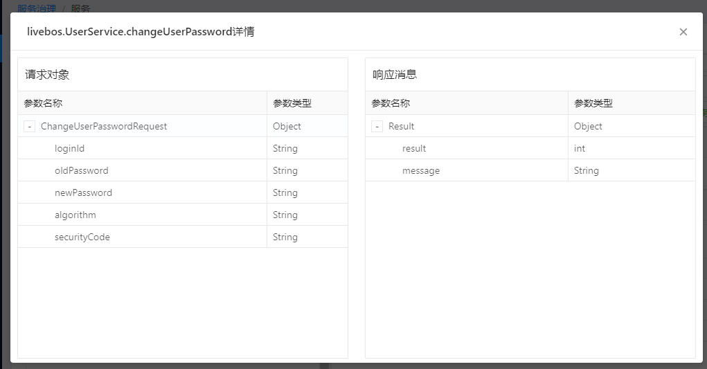
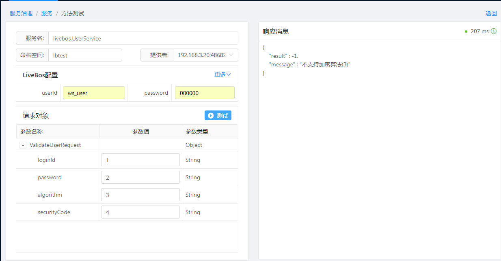
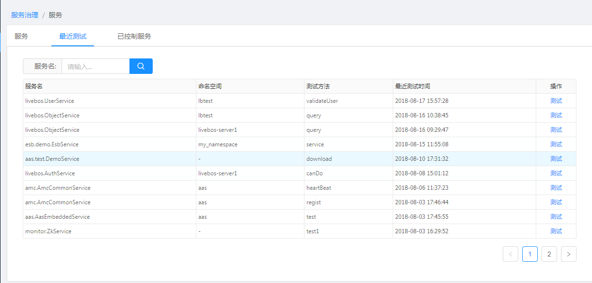
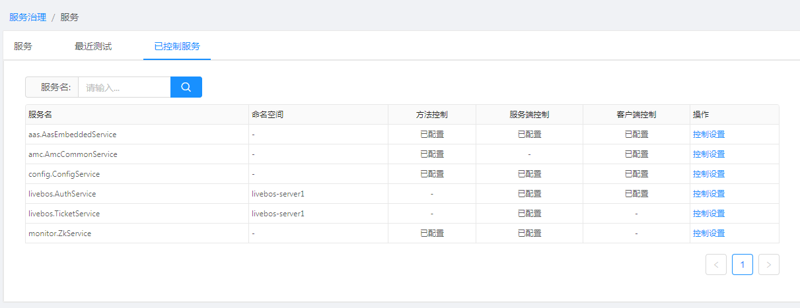
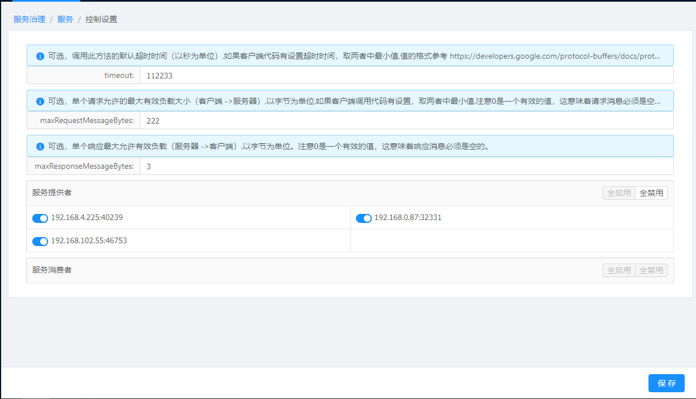

[【返回目录】](../README.md)

# 服务治理-服务

### 基础介绍: 集成了服务树、服务测试、最近服务测试和服务配置

1. 服务: 显示基础的服务信息,包括服务提供者、服务消费者、状态、服务的方法列表以及服务测试
2. 最近测试: 最近的测试显示,可以再这个tab页进行测试跳转
3. 服务配置: 对服务提供者、或者服务消费者进行启用禁用,对访问方法的超时时间、访问最大报文大小和返回最大的保温大小进行限制

特殊服务说明:
1. 命名空间为aas 只能查看不能测试和配置
2. 服务ID前缀为livebos 的 测试的时候需要livebos的配置信息包括账号密码等.目前定位是livebos服务是用前缀去判断。

### 服务
- 左边服务树和zookeeper 路径/ams/{serviceId} or /ams/{namespace}/serviceId 一致
	- 可以对微服务进行检索，如图
	- 

- 右侧显示服务的一些信息，以及可以配置

	- 详情
	- 
	- 服务名称: 服务名
	- 命名空间: 服务命名空间
	- 状态: 当前服务可不可用
	- 服务提供者: 提供服务的主机以及端口
	- 服务消费者: 消费该服务的客户端主机以及端口
	- 服务方法: 服务提供的方法列表, 如图详情,服务列表出不来,aas版本过低，更新下平台版本。再进行查看
	- 服务操作以及配置:
		- 启用
			- 对服务提供者进行开启 或者 对服务消费者访问进行启用
		- 禁用
			- 对服务提供者进行服务暂停服务 或者 对服务消费者进行限制访问该服务
		- 控制定义
			- 
			- timeout：可选，调用此方法的默认超时时间（以秒为单位）,如果客户端代码有设置超时时间，取两者中最小值,值的格式参考 https://developers.google.com/protocol-buffers/docs/proto3#json
			- maxRequestMessageBytes：可选，单个请求允许的最大有效负载大小（客户端 ->服务器）,以字节为单位.如果客户端调用代码有设置，取两者中最小值.注意0是一个有效的值，这意味着请求消息必须是空的。
			- maxResponseMessageBytes：可选，单个响应最大允许有效负载（服务器 ->客户端）,以字节为单位。注意0是一个有效的值，这意味着响应消息必须是空的。
		- 详情
			- 
			- 微服务方法请求对象和响应对象的详情
		- 测试
			- 
			- 针对服务方法进行测试, 请求对象为方法的入参,可以根据提供者下拉框选择对应的提供者进行测试
			- 响应消息, 对测试结果进行反馈。响应消息右边有个状态和消耗时间

---

### 最近测试

> 
>
> 查询最近测试的服务,可以再这边很快的找到运维人员最近测试的服务，然后再这边进行点击测试。
>
> 可以对服务名进行检索

### 已控制服务

> 
>
> 
>
> 对服务操作(启用|禁用|控制定义)过的服务进行显示，以便可以修改对应已配置的微服务信息
> - 方法控制： 对方法timeout、maxRequestMessageBytes、maxResponseMessageBytes 进行配置过的。
> - 服务端控制: 对服务提供者启用禁用过的会显示成已配置
> - 客户端控制: 对服务消费者启用禁用过的会显示成已配置
>
> 可以对服务名进行检索

[【返回目录】](../README.md)
