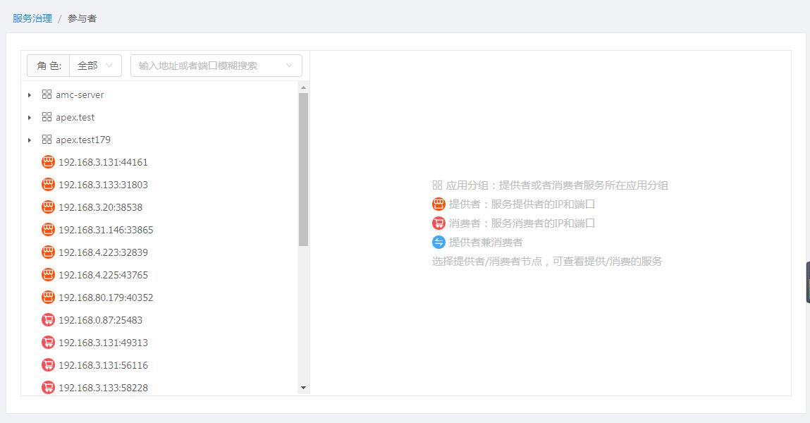
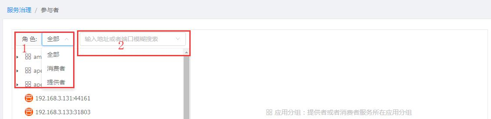
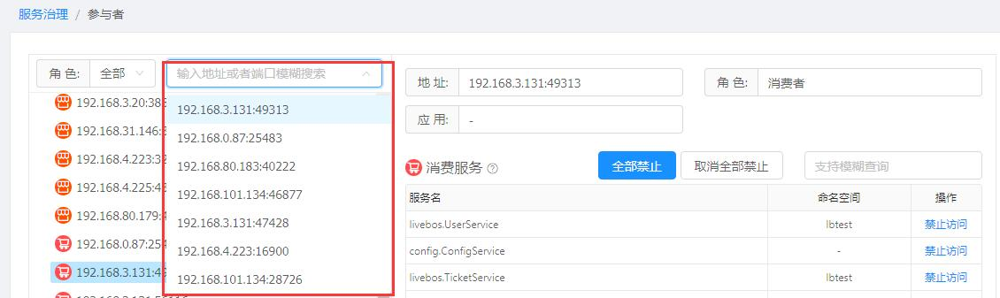
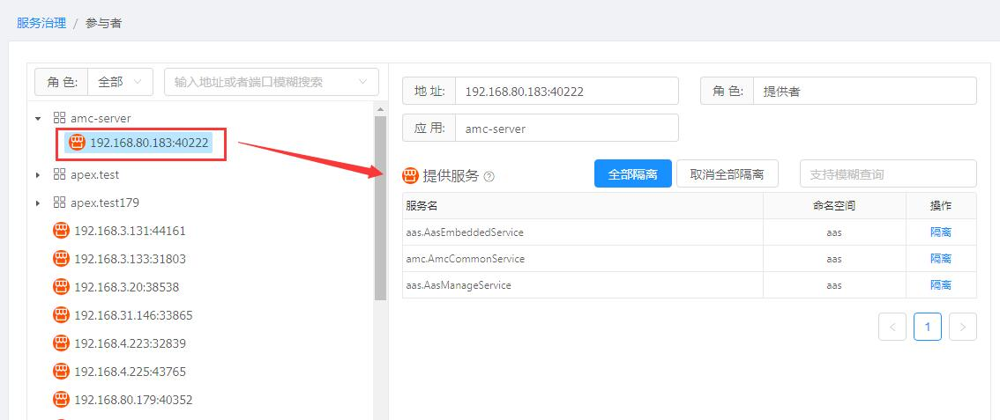
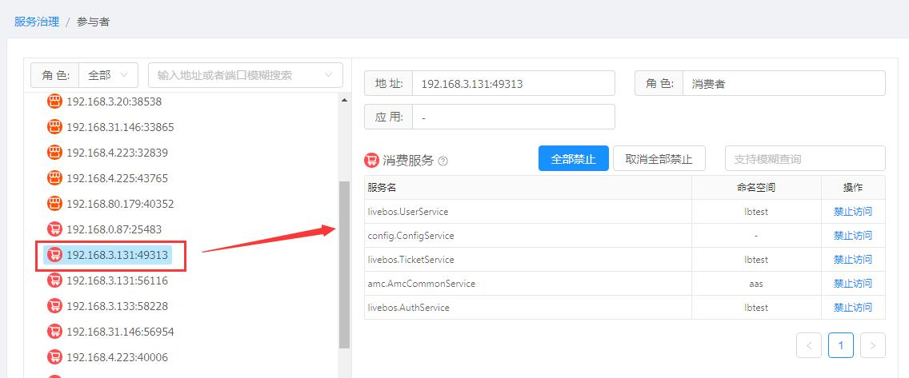

[【返回目录】](../README.md)

# 参与者-操作手册 #
参与者指微服务环境中的服务提供者（提供服务）和服务消费者（调用服务）。

## 初始界面 ##
- 左边：参与者信息
	- 树结构： 按应用分组、ip排序展示，以不同图标区分提供者和消费者
	- 角色筛选： 默认显示全部，可下拉选择只看提供者或者只看消费者
	- 输入框查询： 可输入、下拉，下拉展示最近查看的10个参与者地址，也可输入地址模糊匹配展示
- 右边：提供者、消费者图标说明、简单操作说明

## 提供者 ##
- 基本信息：
	- 地址： 提供者所在服务器的ip和端口
	- 角色： 当前参与者的角色
	- 应用： 当前提供者所属应用，如无显示“-”
- 提供服务：
	- 列表：当前提供者提供的所有服务
	- 查询：服务列表右上方输入框，可输入服务ID模糊搜索服务
	- 隔离：针对提供的服务，隔离客户端访问该服务器，即客户端调用同样名称的服务，不会访问到该提供者。  可单个隔离（取消隔离），也可全部隔离（取消隔离）

## 消费者 ##
- 基本信息：
	- 地址： 消费者者所在服务器的ip和端口
	- 角色： 当前参与者的角色
	- 应用： 当前消费者所属应用，如无显示“-”
- 消费服务：
	- 列表：当前消费者消费的所有服务
	- 查询：服务列表右上方输入框，可输入服务ID模糊搜索服务
	- 禁止访问：针对服务，禁止客户端访问该服务，即禁止消费者访问对应的服务。  可单个禁止（取消禁止），也可全部禁止（取消禁止）

[【返回目录】](../README.md)
