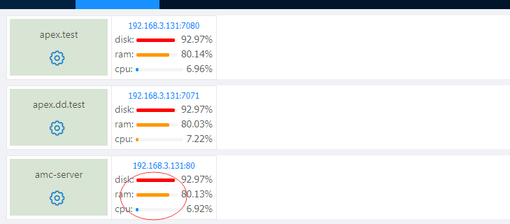

[【返回目录】](../README.md)

# 系统管理 》 设置

## 基础说明：

### 1.用于对系统的一些配置。现在暂时提供阀值配置

> 1. 阀值配置开关: 开启后会在应用管理页面进行颜色提示
>
> 
> 2. CPU阀值: cpu预警百分比    normal->warning->urgent
> 3. 硬盘阀值: 磁盘预警百分比   normal->warning->urgent
> 4. 内存阀值: 内存预警百分比   normal->warning->urgent

### 2.设置
设置的内容可以用xml来配置，文件在config/settingMenu.xml.

xml配置提供开关、滑块、范围滑块和下拉框

> 1.开关
>
> 
>```xml
>   <config>
>     <id>threshold_status</id>
>     <name>阀值配置开关</name>
>     <description>系统监控指标阀值总开关</description>
>     <type>switch</type>
>   </config>
>```
> - id: 唯一标识(必填)
> - name: 显示名称(必填)
> - description: 描述
> - type:switch 开关类型(必填)
>
> 2.范围滑块
>```xml
>   <config>
>      <id>cpu_threshold</id>
>      <name>CPU阀值</name>
>      <description>当CPU使用率达到此百分比，通知管理员</description>
>      <type>rangeSlider</type>
>   </config>
> ```
> - id: 唯一标识(必填)
> - name: 显示名称(必填)
> - description: 描述
> - type:rangeSlider 范围类型(必填)
>
> 3.滑块
> ```xml
>    <config>
>       <id>over_time_threshold</id>
>       <name>请求超时阀值</name>
>       <description>请求超时阀值单位秒</description>
>       <type>slider</type>
>       <min>1</min>
>       <max>20</max>
>    </config>
> ```
> - id: 唯一标识(必填)
> - name: 显示名称(必填)
> - description: 描述
> - type:slider 范围类型(必填)
> - min: 滑块最小值
> - max: 滑块最大值
>
> 4.下拉框
> ```xml
>    <config>
>       <id>operation_telphone</id>
>       <name>预警通知手机</name>
>       <description>中间件异常，主机异常，通知人员手机</description>
>       <type>selectBox</type>
>       <service>configService</service>
>       <method>getPhones</method>
>    </config>
> ```
> - id: 唯一标识(必填)
> - name: 显示名称(必填)
> - description: 描述
> - type:selectBox 范围类型(必填)
> - service: 系统@Service Component提供的服务
> - method: 系统@Service Component对应的方法 无入参
>


[【返回目录】](../README.md)
