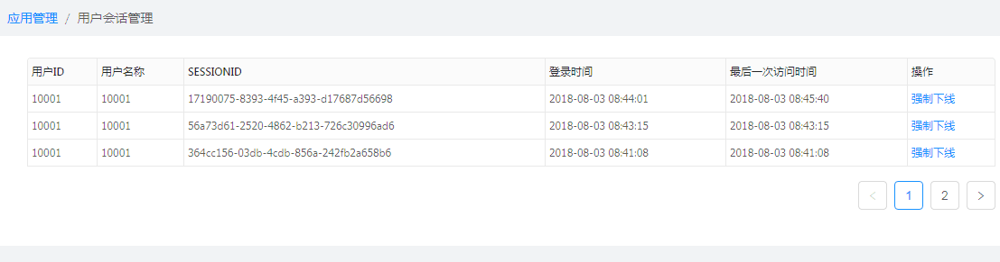

[【返回目录】](../README.md)

# 用户会话管理操作手册 #
查看当前应用下所有登录用户的会话信息，可对用户会话信息进行强制下线操作

- 会话信息：
	- 用户ID： 用户登录的账号
	- 用户名称： 用户名称
	- SESSIONID：登录成功后的会话ID
	- 登录时间：登录成功时间
	- 最后一次访问时间：用户最后一次访问应用的时间
	- 操作：强制下线

[【返回目录】](../README.md)
